# Diagram 1: High-Level System Architecture

A comprehensive view of the entire Odisha Flood Validation System ecosystem, showing how data flows from users through the processing layers to external services.

## Mermaid Code

```mermaid
flowchart TD
    subgraph UserLayer["👤 User Layer"]
        WEB["🖥️ Web Dashboard<br/>(React.js)"]
        PWA["📱 Mobile PWA<br/>(React Native)"]
        SOCIAL["🐦 Social Media<br/>(Twitter/Facebook)"]
    end

    subgraph APIGateway["🚪 API Gateway"]
        FASTAPI["⚡ FastAPI Backend<br/>(Uvicorn)"]
        CORS["🔒 CORS Middleware"]
        AUTH["🔑 Auth Layer"]
    end

    subgraph ProcessingLayer["⚙️ Processing Layer"]
        KAFKA["📡 Kafka Streams<br/>(Event Bus)"]
        VALIDATION["🤖 5-Layer Validation Engine"]
        
        subgraph MLModels["🧠 ML Models"]
            RF["Random Forest<br/>(Physical Plausibility)"]
            DBSCAN["DBSCAN<br/>(Spatial Clustering)"]
            IMGCLS["Image Classifier<br/>(Flood Detection)"]
            WEIGHT["Weight Network<br/>(Adaptive Learning)"]
        end
    end

    subgraph DataStorage["💾 Data Storage"]
        POSTGIS["🐘 PostgreSQL + PostGIS<br/>(Geo-Spatial)"]
        S3["☁️ AWS S3<br/>(Image Storage)"]
        REDIS["⚡ Redis<br/>(Cache/Session)"]
    end

    subgraph ExternalAPIs["🌐 External APIs"]
        TWITTER["🐦 Twitter API<br/>(Social Ingestion)"]
        BHUVAN["🛰️ ISRO Bhuvan<br/>(Satellite Data)"]
        GMAPS["📍 Google Maps<br/>(Geocoding)"]
        IMD["🌧️ IMD Weather<br/>(Rainfall Data)"]
        TWILIO["📞 Twilio<br/>(SMS Alerts)"]
        VISION["👁️ Google Vision<br/>(Image Analysis)"]
    end

    subgraph GeoData["🗺️ Geospatial Data"]
        DEM["🏔️ DEM Raster<br/>(30m Resolution)"]
        HAND["💧 HAND Index<br/>(Height Above Stream)"]
        SLOPE["📐 Slope Map<br/>(WhiteboxTools)"]
    end

    %% User Layer Connections
    WEB --> FASTAPI
    PWA --> FASTAPI
    SOCIAL --> TWITTER

    %% API Gateway Flow
    FASTAPI --> CORS
    CORS --> AUTH
    AUTH --> KAFKA
    AUTH --> VALIDATION

    %% Kafka Distribution
    KAFKA --> VALIDATION
    TWITTER --> KAFKA

    %% Validation Engine
    VALIDATION --> RF
    VALIDATION --> DBSCAN
    VALIDATION --> IMGCLS
    VALIDATION --> WEIGHT
    
    %% ML to Geo Data
    RF --> DEM
    RF --> HAND
    RF --> SLOPE

    %% Storage Connections
    FASTAPI --> POSTGIS
    FASTAPI --> S3
    FASTAPI --> REDIS
    VALIDATION --> POSTGIS

    %% External API Connections
    FASTAPI --> GMAPS
    FASTAPI --> IMD
    FASTAPI --> TWILIO
    FASTAPI --> VISION
    FASTAPI --> BHUVAN

    %% Styling
    classDef userNode fill:#e1f5fe,stroke:#01579b,stroke-width:2px
    classDef apiNode fill:#fff3e0,stroke:#e65100,stroke-width:2px
    classDef mlNode fill:#f3e5f5,stroke:#7b1fa2,stroke-width:2px
    classDef dataNode fill:#e8f5e9,stroke:#2e7d32,stroke-width:2px
    classDef extNode fill:#fce4ec,stroke:#c2185b,stroke-width:2px
    classDef geoNode fill:#fff8e1,stroke:#f57f17,stroke-width:2px

    class WEB,PWA,SOCIAL userNode
    class FASTAPI,CORS,AUTH apiNode
    class RF,DBSCAN,IMGCLS,WEIGHT,VALIDATION,KAFKA mlNode
    class POSTGIS,S3,REDIS dataNode
    class TWITTER,BHUVAN,GMAPS,IMD,TWILIO,VISION extNode
    class DEM,HAND,SLOPE geoNode
```

## Key Components

| Layer | Technology | Purpose |
|-------|------------|---------|
| User Interface | React, React Native | Web dashboard and mobile app |
| API Gateway | FastAPI + Uvicorn | RESTful API with async support |
| Processing | Kafka, Python | Real-time event streaming |
| Validation | Random Forest, DBSCAN | Multi-layer ML validation |
| Storage | PostGIS, S3, Redis | Geospatial, media, and cache |
| External | Twitter, IMD, ISRO | Data augmentation services |
