# Diagram 2: Real-Time Data Ingestion Pipeline

This diagram illustrates the streaming architecture for ingesting crowdsourced flood reports from multiple sources, decoupling data collection from validation processing.

## Mermaid Code

```mermaid
flowchart LR
    subgraph Sources["📥 Data Sources"]
        TWITTER["🐦 Twitter API<br/>(v2 Streaming)"]
        FB["📘 Facebook API<br/>(Webhooks)"]
        APP["📱 Mobile App<br/>(Direct Submit)"]
        WEB["🖥️ Web Portal<br/>(Form Submit)"]
        SMS["📞 SMS Gateway<br/>(Twilio Webhook)"]
    end

    subgraph Ingestion["📡 Kafka Ingestion Layer"]
        TOPIC_RAW["📨 Topic: raw_reports<br/>(Partitioned by Region)"]
        TOPIC_SOCIAL["📨 Topic: social_media<br/>(High Volume)"]
        TOPIC_VERIFIED["📨 Topic: verified_reports<br/>(Post-Validation)"]
    end

    subgraph Consumers["🔧 Python Consumers"]
        CONSUMER1["🐍 Consumer Group 1<br/>(Preprocessing)"]
        CONSUMER2["🐍 Consumer Group 2<br/>(Geocoding)"]
        CONSUMER3["🐍 Consumer Group 3<br/>(NLP Extraction)"]
    end

    subgraph Preprocessing["⚙️ Preprocessing Pipeline"]
        GEOCODE["📍 Geocoding Service<br/>(Google Maps API)"]
        NLP["📝 NLP Extraction<br/>(spaCy/Transformers)"]
        NORMALIZE["🔄 Data Normalization<br/>(Schema Validation)"]
        DEDUPE["🧹 Deduplication<br/>(Fuzzy Matching)"]
    end

    subgraph Storage["💾 PostGIS Database"]
        REPORTS["📊 flood_reports<br/>(Point Geometry)"]
        METADATA["📋 validation_metadata<br/>(Raster Lookups)"]
        USERS["👤 users<br/>(Trust Scores)"]
    end

    subgraph Validation["🤖 Validation Trigger"]
        TRIGGER["⚡ Async Task<br/>(Celery/RQ)"]
        VALIDATOR["🔍 5-Layer Validator<br/>(ML Pipeline)"]
    end

    %% Source to Kafka
    TWITTER --> TOPIC_SOCIAL
    FB --> TOPIC_SOCIAL
    APP --> TOPIC_RAW
    WEB --> TOPIC_RAW
    SMS --> TOPIC_RAW

    %% Kafka to Consumers
    TOPIC_RAW --> CONSUMER1
    TOPIC_RAW --> CONSUMER2
    TOPIC_SOCIAL --> CONSUMER3

    %% Consumer Processing
    CONSUMER1 --> NORMALIZE
    CONSUMER2 --> GEOCODE
    CONSUMER3 --> NLP

    %% Preprocessing Pipeline
    NORMALIZE --> DEDUPE
    GEOCODE --> DEDUPE
    NLP --> DEDUPE

    %% To Storage
    DEDUPE --> REPORTS
    DEDUPE --> METADATA
    DEDUPE --> USERS

    %% Validation Trigger
    REPORTS --> TRIGGER
    TRIGGER --> VALIDATOR
    VALIDATOR --> TOPIC_VERIFIED
    VALIDATOR --> REPORTS

    %% Styling
    classDef sourceNode fill:#bbdefb,stroke:#1565c0,stroke-width:2px
    classDef kafkaNode fill:#c8e6c9,stroke:#2e7d32,stroke-width:2px
    classDef consumerNode fill:#fff9c4,stroke:#f9a825,stroke-width:2px
    classDef processNode fill:#f3e5f5,stroke:#7b1fa2,stroke-width:2px
    classDef storageNode fill:#ffe0b2,stroke:#ef6c00,stroke-width:2px
    classDef validNode fill:#ffcdd2,stroke:#c62828,stroke-width:2px

    class TWITTER,FB,APP,WEB,SMS sourceNode
    class TOPIC_RAW,TOPIC_SOCIAL,TOPIC_VERIFIED kafkaNode
    class CONSUMER1,CONSUMER2,CONSUMER3 consumerNode
    class GEOCODE,NLP,NORMALIZE,DEDUPE processNode
    class REPORTS,METADATA,USERS storageNode
    class TRIGGER,VALIDATOR validNode
```



## Pipeline Stages

| Stage | Component | Technology | Throughput |
|-------|-----------|------------|------------|
| **1. Ingestion** | Kafka Topics | Apache Kafka | 10K msgs/sec |
| **2. Consumption** | Consumer Groups | Python + kafka-python | Parallel processing |
| **3. Geocoding** | Location Resolution | Google Maps API | 50 req/sec |
| **4. NLP** | Text Extraction | spaCy + Transformers | Batch processing |
| **5. Normalization** | Schema Validation | Pydantic | Real-time |
| **6. Deduplication** | Fuzzy Matching | RapidFuzz | Near-duplicate removal |
| **7. Storage** | PostGIS Insert | GeoAlchemy2 | Bulk upsert |

## Topic Schema

```json
{
  "topic": "raw_reports",
  "schema": {
    "report_id": "uuid",
    "source": "enum(twitter|facebook|app|web|sms)",
    "raw_text": "string",
    "coordinates": {"lat": "float", "lon": "float"},
    "timestamp": "iso8601",
    "media_urls": ["string"],
    "user_handle": "string"
  }
}
```
