# Diagram 3: 5-Layer Validation Algorithm

The core novelty of this system: a multi-layer ML-enhanced validation pipeline that determines the authenticity of crowdsourced flood reports. This diagram is designed for use in research papers.

## Mermaid Code

```mermaid
flowchart TD
    subgraph Input["📥 Input: User Report"]
        REPORT["🗒️ Flood Report<br/>(lat, lon, depth, timestamp, photo)"]
    end

    subgraph Layer1["🏔️ Layer 1: Physical Plausibility"]
        DEM_CHECK["📊 DEM Lookup<br/>(Elevation at Point)"]
        HAND_CHECK["💧 HAND Index<br/>(Height Above Nearest Drainage)"]
        SLOPE_CHECK["📐 Slope Analysis<br/>(WhiteboxTools)"]
        RF_MODEL["🌳 Random Forest<br/>(Trained on Mahanadi Basin)"]
        
        DEM_CHECK --> RF_MODEL
        HAND_CHECK --> RF_MODEL
        SLOPE_CHECK --> RF_MODEL
        
        RF_MODEL --> L1_SCORE["Score: 0.0 - 1.0"]
    end

    subgraph Layer2["📊 Layer 2: Statistical Consistency"]
        SPATIAL["🗺️ Spatial Query<br/>(Reports within 5km, 24h)"]
        DBSCAN_ALGO["🔬 DBSCAN Clustering<br/>(eps=1km, min_samples=3)"]
        CONSENSUS["📈 Consensus Score<br/>(Cluster Density)"]
        
        SPATIAL --> DBSCAN_ALGO
        DBSCAN_ALGO --> CONSENSUS
        CONSENSUS --> L2_SCORE["Score: 0.0 - 1.0"]
    end

    subgraph Layer3["👤 Layer 3: User Reputation"]
        USER_HIST["📜 User History<br/>(Previous Reports)"]
        BAYESIAN["🎲 Bayesian Update<br/>(Beta Distribution)"]
        TRUST["⭐ Trust Score<br/>(α / (α + β))"]
        
        USER_HIST --> BAYESIAN
        BAYESIAN --> TRUST
        TRUST --> L3_SCORE["Score: 0.0 - 1.0"]
    end

    subgraph Layer4["📰 Layer 4: Social Context"]
        NEWS_API["📡 NewsAPI Query<br/>(Odisha + Flood + Location)"]
        TWEET_SEARCH["🐦 Twitter Search<br/>(Matching Keywords)"]
        CORROBORATION["✅ Corroboration Check<br/>(External Validation)"]
        
        NEWS_API --> CORROBORATION
        TWEET_SEARCH --> CORROBORATION
        CORROBORATION --> L4_SCORE["Score: 0.0 - 1.0"]
    end

    subgraph Layer5["📸 Layer 5: Computer Vision"]
        IMG_INPUT["🖼️ User Photo<br/>(JPEG/PNG)"]
        CNN_MODEL["🧠 CNN Classifier<br/>(ResNet-50 Fine-tuned)"]
        WATER_DETECT["💧 Water Detection<br/>(Segmentation Ratio)"]
        
        IMG_INPUT --> CNN_MODEL
        CNN_MODEL --> WATER_DETECT
        WATER_DETECT --> L5_SCORE["Score: 0.0 - 1.0"]
    end

    subgraph Aggregation["⚖️ Weighted Aggregation"]
        WEIGHT_NET["🔗 Weight Learning Network<br/>(Adaptive Weights)"]
        FINAL_CALC["➕ Σ(wᵢ × scoreᵢ)<br/>(Learned Weights)"]
        
        L1_SCORE --> WEIGHT_NET
        L2_SCORE --> WEIGHT_NET
        L3_SCORE --> WEIGHT_NET
        L4_SCORE --> WEIGHT_NET
        L5_SCORE --> WEIGHT_NET
        
        WEIGHT_NET --> FINAL_CALC
    end

    subgraph Output["📤 Output: Validation Result"]
        THRESHOLD{"Final Score<br/>≥ 0.7?"}
        VALIDATED["✅ VALIDATED<br/>(High Confidence)"]
        FLAGGED["⚠️ FLAGGED<br/>(Manual Review)"]
        REJECTED["❌ REJECTED<br/>(Low Confidence)"]
    end

    %% Main Flow
    REPORT --> DEM_CHECK
    REPORT --> SPATIAL
    REPORT --> USER_HIST
    REPORT --> NEWS_API
    REPORT --> IMG_INPUT

    FINAL_CALC --> THRESHOLD
    THRESHOLD -->|"≥ 0.7"| VALIDATED
    THRESHOLD -->|"0.4 - 0.7"| FLAGGED
    THRESHOLD -->|"< 0.4"| REJECTED

    %% Styling
    classDef inputNode fill:#e3f2fd,stroke:#1565c0,stroke-width:2px
    classDef layer1 fill:#e8f5e9,stroke:#2e7d32,stroke-width:2px
    classDef layer2 fill:#fff3e0,stroke:#ef6c00,stroke-width:2px
    classDef layer3 fill:#fce4ec,stroke:#c2185b,stroke-width:2px
    classDef layer4 fill:#f3e5f5,stroke:#7b1fa2,stroke-width:2px
    classDef layer5 fill:#e0f7fa,stroke:#00838f,stroke-width:2px
    classDef aggregateNode fill:#fff8e1,stroke:#f9a825,stroke-width:2px
    classDef outputGood fill:#c8e6c9,stroke:#2e7d32,stroke-width:3px
    classDef outputWarn fill:#fff9c4,stroke:#f9a825,stroke-width:3px
    classDef outputBad fill:#ffcdd2,stroke:#c62828,stroke-width:3px

    class REPORT inputNode
    class DEM_CHECK,HAND_CHECK,SLOPE_CHECK,RF_MODEL,L1_SCORE layer1
    class SPATIAL,DBSCAN_ALGO,CONSENSUS,L2_SCORE layer2
    class USER_HIST,BAYESIAN,TRUST,L3_SCORE layer3
    class NEWS_API,TWEET_SEARCH,CORROBORATION,L4_SCORE layer4
    class IMG_INPUT,CNN_MODEL,WATER_DETECT,L5_SCORE layer5
    class WEIGHT_NET,FINAL_CALC,THRESHOLD aggregateNode
    class VALIDATED outputGood
    class FLAGGED outputWarn
    class REJECTED outputBad
```

## Layer Weights (Learned via Ground Truth)

| Layer | Default Weight | Description |
|-------|---------------|-------------|
| **L1: Physical** | 0.35 | Terrain-based flood feasibility |
| **L2: Statistical** | 0.25 | Neighbor report clustering |
| **L3: Reputation** | 0.20 | User historical accuracy |
| **L4: Social** | 0.10 | External news corroboration |
| **L5: Vision** | 0.10 | Image-based water detection |

## Mathematical Formulation

### Final Score Computation

$$
S_{final} = \sum_{i=1}^{5} w_i \cdot S_i
$$

Where:
- $w_i$ = Learned weight for layer $i$
- $S_i$ = Score from layer $i$
- $\sum w_i = 1$ (normalized)

### Bayesian Trust Update (Layer 3)

$$
\text{Trust} = \frac{\alpha}{\alpha + \beta}
$$

After each validated report:
- Correct: $\alpha \leftarrow \alpha + 1$
- Incorrect: $\beta \leftarrow \beta + 1$
