# Diagram 4: Flood Report Lifecycle (Enhanced)

A comprehensive state diagram showing the complete lifecycle of a flood report from submission to final status, including all possible state transitions, sub-states, and database field mappings.

---

## Primary State Machine

---

## Simplified State Diagram (For Papers)

```mermaid
stateDiagram-v2
    [*] --> Pending: Submit
    Pending --> Validating: Process
    Validating --> Validated: S ≥ 0.7
    Validating --> Flagged: 0.4 ≤ S < 0.7
    Validating --> Rejected: S < 0.4
    Flagged --> Validated: Manual Approve
    Flagged --> Rejected: Manual Reject
    Validated --> Archived: TTL Expires
    Rejected --> [*]: Discard
    Archived --> [*]: Store
```

---

## Database Field Mapping

| State | `validation_status` | `final_score` | `validated_at` |
|-------|---------------------|---------------|----------------|
| **Submitted** | `pending` | `NULL` | `NULL` |
| **Validating** | `validating` | `NULL` | `NULL` |
| **Validated** | `validated` | `0.7 - 1.0` | `NOW()` |
| **Flagged** | `flagged` | `0.4 - 0.69` | `NULL` |
| **Rejected** | `rejected` | `0.0 - 0.39` | `NOW()` |
| **Archived** | `archived` | Preserved | Preserved |

---

## Transition Events & Handlers

```mermaid
flowchart LR
    subgraph Events["📩 Triggering Events"]
        E1["HTTP POST /api/reports"]
        E2["Celery Task Pickup"]
        E3["Validation Complete"]
        E4["Admin Action"]
        E5["Cron Job (daily)"]
    end
    
    subgraph Handlers["⚙️ Event Handlers"]
        H1["submit_report()"]
        H2["FloodReportValidator.validate_report()"]
        H3["update_report_status()"]
        H4["manual_override()"]
        H5["archive_old_reports()"]
    end
    
    subgraph Effects["💾 Side Effects"]
        S1["Insert to flood_reports"]
        S2["Update scores + status"]
        S3["Trigger notifications"]
        S4["Log audit trail"]
        S5["Move to cold storage"]
    end
    
    E1 --> H1 --> S1
    E2 --> H2 --> S2
    E3 --> H3 --> S3
    E4 --> H4 --> S4
    E5 --> H5 --> S5
```

---

## Time-Based Transitions

| Transition | Condition | Action |
|------------|-----------|--------|
| Pending → Validating | Celery worker picks up | Start 5-layer validation |
| Flagged → Auto-Reject | No review after 72 hours | Auto-reject + notify admin |
| Validated → Archived | Report older than 7 days + event closed | Move to archive table |
| Rejected → Purge | Report older than 30 days | Soft delete (GDPR) |

---

## Error States

