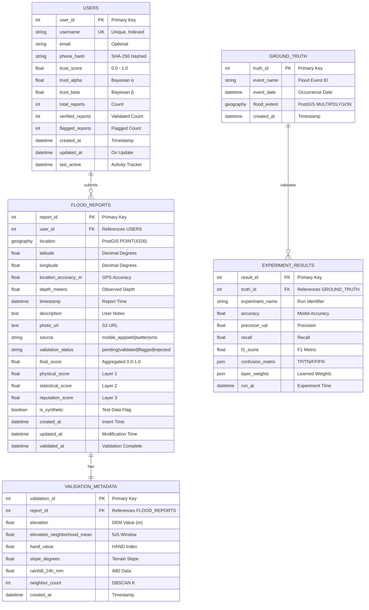

# Diagram 5: Database Entity Relationship Diagram

The PostGIS database schema showing relationships between core entities in the flood validation system.

## Mermaid Code



## Indexes and Constraints

```sql
-- Primary Keys
ALTER TABLE users ADD PRIMARY KEY (user_id);
ALTER TABLE flood_reports ADD PRIMARY KEY (report_id);
ALTER TABLE validation_metadata ADD PRIMARY KEY (validation_id);
ALTER TABLE ground_truth ADD PRIMARY KEY (truth_id);

-- Unique Constraints
ALTER TABLE users ADD CONSTRAINT uq_username UNIQUE (username);

-- Foreign Keys
ALTER TABLE flood_reports 
    ADD CONSTRAINT fk_user 
    FOREIGN KEY (user_id) REFERENCES users(user_id) ON DELETE SET NULL;

ALTER TABLE validation_metadata 
    ADD CONSTRAINT fk_report 
    FOREIGN KEY (report_id) REFERENCES flood_reports(report_id) ON DELETE CASCADE;

-- Spatial Indexes (PostGIS)
CREATE INDEX idx_reports_location ON flood_reports USING GIST (location);
CREATE INDEX idx_ground_truth_extent ON ground_truth USING GIST (flood_extent);

-- Performance Indexes
CREATE INDEX idx_reports_status ON flood_reports (validation_status);
CREATE INDEX idx_reports_timestamp ON flood_reports (timestamp);
CREATE INDEX idx_users_trust ON users (trust_score DESC);
```

## PostGIS Extensions

```sql
-- Enable PostGIS
CREATE EXTENSION IF NOT EXISTS postgis;

-- Spatial Reference System (WGS84)
-- SRID 4326 is used for GPS coordinates
SELECT ST_SetSRID(ST_MakePoint(longitude, latitude), 4326) AS location;

-- Example: Find reports within 5km radius
SELECT * FROM flood_reports
WHERE ST_DWithin(
    location::geography,
    ST_SetSRID(ST_MakePoint(85.88, 20.46), 4326)::geography,
    5000  -- meters
);
```
