# Diagram 6: API Sequence Diagram - Image Upload Workflow

Detailed sequence diagram showing the interaction between Frontend, Backend, and External Services when a user uploads a flood photo for validation.

## Mermaid Code

```mermaid
sequenceDiagram
    autonumber
    
    actor User
    participant PWA as 📱 Mobile PWA
    participant API as ⚡ FastAPI
    participant S3 as ☁️ AWS S3
    participant Classifier as 🧠 Image Classifier
    participant DB as 🐘 PostGIS
    participant Notify as 📞 Twilio

    User->>PWA: Capture Flood Photo
    activate PWA
    
    PWA->>PWA: Compress Image (< 5MB)
    PWA->>PWA: Extract EXIF GPS
    
    PWA->>API: POST /api/validate-photo<br/>(multipart/form-data)
    activate API
    
    Note over API: Authentication Check
    API->>API: Validate JWT Token
    
    par Upload to S3
        API->>S3: PutObject (photo.jpg)
        activate S3
        S3-->>API: S3 URL (signed)
        deactivate S3
    and Run Image Classification
        API->>Classifier: analyze(image_bytes)
        activate Classifier
        Classifier->>Classifier: Preprocess (resize 224x224)
        Classifier->>Classifier: CNN Forward Pass
        Classifier->>Classifier: Water Segmentation
        Classifier-->>API: {is_flood: true, confidence: 0.87, water_ratio: 0.42}
        deactivate Classifier
    end
    
    alt is_flood_detected == true
        API->>DB: INSERT flood_reports<br/>(with photo_url, confidence)
        activate DB
        DB-->>API: report_id: 12345
        deactivate DB
        
        API->>API: Trigger Async Validation
        
        API->>Notify: SMS Alert (if critical)
        activate Notify
        Notify-->>API: Message SID
        deactivate Notify
        
        API-->>PWA: 201 Created<br/>{report_id: 12345, status: "pending"}
    else is_flood_detected == false
        API-->>PWA: 422 Unprocessable<br/>{error: "No flood detected in image"}
    end
    
    deactivate API
    
    PWA->>PWA: Show Success Toast
    PWA-->>User: "Report Submitted ✓"
    deactivate PWA
    
    Note over User,Notify: Async Validation Continues in Background
    
    rect rgb(240, 240, 240)
        Note right of API: Background Processing
        API->>API: 5-Layer Validation
        API->>DB: UPDATE status = 'validated'
        API->>Notify: Push Notification
    end
```



## Alternative: Report Submission Flow

```mermaid
sequenceDiagram
    autonumber
    
    actor User
    participant App as 📱 Mobile App
    participant API as ⚡ FastAPI
    participant Validator as 🤖 Validator
    participant DB as 🐘 PostGIS

    User->>App: Fill Flood Report Form
    App->>App: Validate Coordinates
    App->>App: Get Current Location (GPS)
    
    App->>API: POST /api/reports
    activate API
    
    API->>API: Pydantic Schema Validation
    API->>DB: INSERT flood_reports (pending)
    DB-->>API: report_id
    
    API->>Validator: validate_report(report)
    activate Validator
    
    Note over Validator: 5-Layer Processing
    Validator->>Validator: Layer 1: Physical
    Validator->>Validator: Layer 2: Statistical
    Validator->>Validator: Layer 3: Reputation
    Validator->>Validator: Layer 4: Social
    Validator->>Validator: Layer 5: Vision
    
    Validator-->>API: {status, final_score, details}
    deactivate Validator
    
    API->>DB: UPDATE report SET status, scores
    
    API-->>App: 200 OK {report_id, status, score}
    deactivate API
    
    App-->>User: Show Validation Result
```



## API Endpoint Details

### `POST /api/validate-photo`

**Request:**
```http
POST /api/validate-photo HTTP/1.1
Content-Type: multipart/form-data
Authorization: Bearer <jwt_token>

------boundary
Content-Disposition: form-data; name="file"; filename="flood.jpg"
Content-Type: image/jpeg

<binary image data>
------boundary--
```

**Response (Success):**
```json
{
  "valid": true,
  "is_flood_detected": true,
  "confidence": 0.87,
  "water_coverage": 0.42,
  "model_used": "resnet50_flood_v2",
  "validation_score": 0.85
}
```

**Response (No Flood):**
```json
{
  "valid": false,
  "is_flood_detected": false,
  "confidence": 0.12,
  "water_coverage": 0.03,
  "model_used": "resnet50_flood_v2",
  "validation_score": 0.0
}
```
