# Diagram 7: Containerized Deployment Architecture

Docker Compose deployment configuration showing how the system is containerized for local development and production demo.

## Mermaid Code

```mermaid
flowchart TD
    subgraph HostMachine["🖥️ Host Machine"]
        COMPOSE["🐳 Docker Compose"]
    end

    subgraph DockerNetwork["🌐 flood_validation_network (bridge)"]
        
        subgraph Container1["📦 Container: flood_validation_api"]
            UVICORN["🦄 Uvicorn Server<br/>Port 8000"]
            FASTAPI["⚡ FastAPI App"]
            ML_MODELS["🧠 ML Models<br/>(Loaded in Memory)"]
            
            UVICORN --> FASTAPI
            FASTAPI --> ML_MODELS
        end
        
        subgraph Container2["📦 Container: flood_validation_db"]
            POSTGRES["🐘 PostgreSQL 15"]
            POSTGIS["🗺️ PostGIS 3.3"]
            DATA_VOL[("💾 postgres_data<br/>(Volume)")]
            
            POSTGRES --> POSTGIS
            POSTGRES --> DATA_VOL
        end
        
        subgraph Container3["📦 Container: flood_validation_pgadmin"]
            PGADMIN["🔧 PgAdmin 4<br/>Port 5050"]
            PGADMIN_VOL[("💾 pgadmin_data<br/>(Volume)")]
            
            PGADMIN --> PGADMIN_VOL
        end
        
    end

    subgraph Volumes["📂 Docker Volumes"]
        V1[("postgres_data<br/>Persistent DB")]
        V2[("pgadmin_data<br/>UI State")]
    end

    subgraph BindMounts["📁 Bind Mounts (Development)"]
        SRC["./src → /app/src<br/>(Hot Reload)"]
        DATA["./data → /app/data<br/>(Raster Files)"]
        CONFIG["./config → /app/config<br/>(Settings)"]
    end

    subgraph ExposedPorts["🌍 Exposed Ports"]
        P8000["🔌 8000 (API)"]
        P5432["🔌 5432 (PostgreSQL)"]
        P5050["🔌 5050 (PgAdmin)"]
    end

    %% Connections
    COMPOSE --> Container1
    COMPOSE --> Container2
    COMPOSE --> Container3
    
    Container1 --> Container2
    Container3 --> Container2
    
    V1 --> DATA_VOL
    V2 --> PGADMIN_VOL
    
    SRC --> Container1
    DATA --> Container1
    CONFIG --> Container1
    
    Container1 --> P8000
    Container2 --> P5432
    Container3 --> P5050

    %% Styling
    classDef containerNode fill:#e3f2fd,stroke:#1565c0,stroke-width:2px
    classDef volumeNode fill:#e8f5e9,stroke:#2e7d32,stroke-width:2px
    classDef portNode fill:#fff3e0,stroke:#ef6c00,stroke-width:2px
    classDef mountNode fill:#fce4ec,stroke:#c2185b,stroke-width:2px

    class Container1,Container2,Container3 containerNode
    class V1,V2,DATA_VOL,PGADMIN_VOL volumeNode
    class P8000,P5432,P5050 portNode
    class SRC,DATA,CONFIG mountNode
```



## Docker Compose Services

### Service Configuration

```yaml
services:
  db:
    image: postgis/postgis:15-3.3
    container_name: flood_validation_db
    environment:
      POSTGRES_DB: flood_validation
      POSTGRES_USER: flood_admin
      POSTGRES_PASSWORD: ${DB_PASSWORD}
    volumes:
      - postgres_data:/var/lib/postgresql/data
    healthcheck:
      test: pg_isready -U flood_admin
      interval: 10s

  api:
    build: .
    container_name: flood_validation_api
    environment:
      DATABASE_URL: postgresql://flood_admin:${DB_PASSWORD}@db:5432/flood_validation
    volumes:
      - ./src:/app/src:ro
      - ./data:/app/data:ro
    ports:
      - "8000:8000"
    depends_on:
      db:
        condition: service_healthy

  pgadmin:
    image: dpage/pgadmin4:latest
    container_name: flood_validation_pgadmin
    profiles: [tools]
    ports:
      - "5050:80"
```

## Deployment Commands

```bash
# Start all services
docker-compose up -d

# Start with PgAdmin (optional tool)
docker-compose --profile tools up -d

# View logs
docker-compose logs -f api

# Rebuild after code changes
docker-compose up -d --build api

# Stop all services
docker-compose down

# Clean volumes (WARNING: deletes data)
docker-compose down -v
```

## Health Checks

| Service | Endpoint | Interval |
|---------|----------|----------|
| API | `GET /health` | 30s |
| Database | `pg_isready` | 10s |

## Alternative: Production Architecture

```mermaid
flowchart TD
    subgraph Cloud["☁️ AWS / GCP"]
        LB["⚖️ Load Balancer<br/>(ALB/Nginx)"]
        
        subgraph ECS["🐳 ECS Cluster"]
            API1["FastAPI #1"]
            API2["FastAPI #2"]
            API3["FastAPI #3"]
        end
        
        RDS["🐘 RDS PostgreSQL<br/>(PostGIS Enabled)"]
        S3["☁️ S3 Bucket<br/>(Images)"]
        REDIS["⚡ ElastiCache<br/>(Redis)"]
    end
    
    USER["👤 User"] --> LB
    LB --> API1
    LB --> API2
    LB --> API3
    
    API1 --> RDS
    API2 --> RDS
    API3 --> RDS
    
    API1 --> S3
    API2 --> S3
    API3 --> S3
    
    API1 --> REDIS
    API2 --> REDIS
    API3 --> REDIS
```


