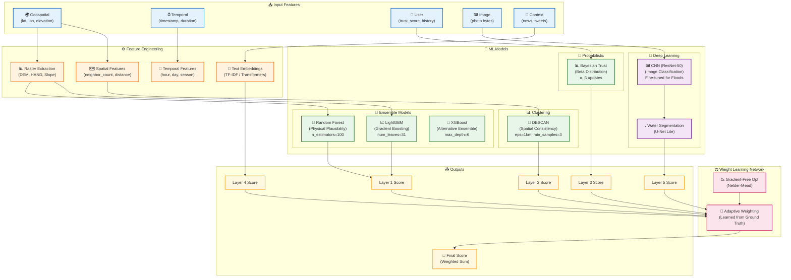
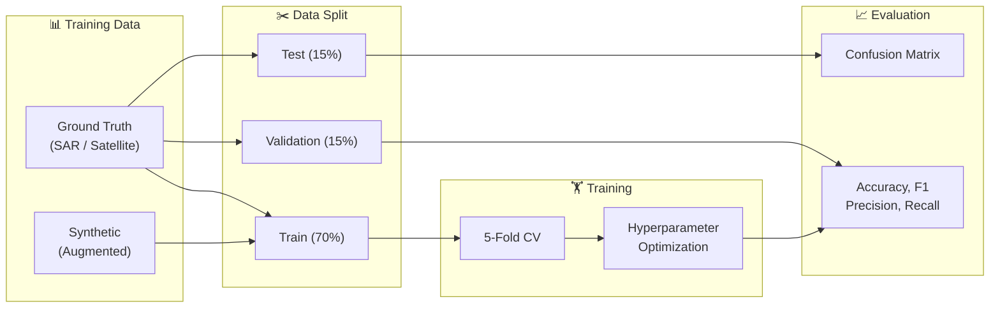

# Diagram 8: ML Model Architecture

Detailed visualization of the machine learning models used in the flood validation system, showing their interconnections and data flow.

## Mermaid Code

## Model Specifications

| Model | Library | Purpose | Hyperparameters |
|-------|---------|---------|-----------------|
| **Random Forest** | scikit-learn | Physical Plausibility | n_estimators=100, max_depth=15 |
| **LightGBM** | lightgbm | Ensemble Boosting | num_leaves=31, learning_rate=0.05 |
| **XGBoost** | xgboost | Alternative Ensemble | max_depth=6, n_estimators=200 |
| **DBSCAN** | scikit-learn | Spatial Clustering | eps=1000m, min_samples=3 |
| **ResNet-50** | PyTorch | Flood Detection | pretrained=ImageNet, fine-tuned |
| **Beta Distribution** | scipy.stats | Trust Scoring | α=1.0, β=1.0 (prior) |

## Training Pipeline

