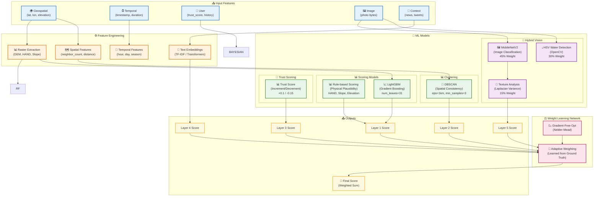
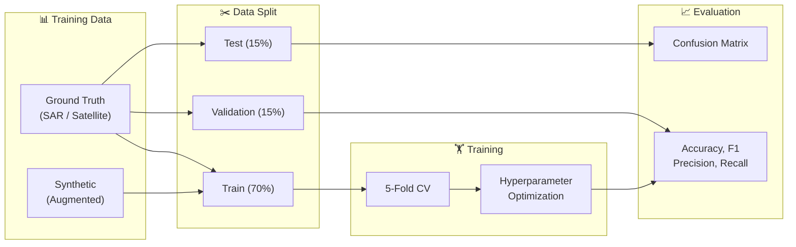

# Diagram 8: ML Model Architecture

Detailed visualization of the machine learning models used in the flood validation system, showing their interconnections and data flow.

## Mermaid Code

```mermaid
flowchart TD
    subgraph Input["📥 Input Features"]
        GEO["🌍 Geospatial<br/>(lat, lon, elevation)"]
        TEMPORAL["⏰ Temporal<br/>(timestamp, duration)"]
        USER["👤 User<br/>(trust_score, history)"]
        IMG["🖼️ Image<br/>(photo bytes)"]
        CONTEXT["📰 Context<br/>(news, tweets)"]
    end

    subgraph FeatureEngineering["⚙️ Feature Engineering"]
        RASTER["📊 Raster Extraction<br/>(DEM, HAND, Slope)"]
        SPATIAL["🗺️ Spatial Features<br/>(neighbor_count, distance)"]
        TEMPORAL_FE["📅 Temporal Features<br/>(hour, day, season)"]
        TEXT_FE["📝 Text Embeddings<br/>(TF-IDF / Transformers)"]
    end

    subgraph Models["🧠 ML Models"]
        subgraph Ensemble["📊 Scoring Models"]
            RULE["📊 Rule-based Scoring<br/>(Physical Plausibility)<br/>HAND, Slope, Elevation"]
            LGB["📈 LightGBM<br/>(Gradient Boosting)<br/>num_leaves=31"]
        end
        
        subgraph Clustering["📊 Clustering"]
            DBSCAN["🔬 DBSCAN<br/>(Spatial Consistency)<br/>eps=1km, min_samples=3"]
        end
        
        subgraph DeepLearning["🧠 Hybrid Vision"]
            CNN["🖼️ MobileNetV2<br/>(Image Classification)<br/>45% Weight"]
            HSV_DET["💧 HSV Water Detection<br/>(OpenCV)<br/>30% Weight"]
            TEXTURE["📐 Texture Analysis<br/>(Laplacian Variance)<br/>15% Weight"]
        end
        
        subgraph Probabilistic["🎲 Trust Scoring"]
            TRUST_SCORE["📊 Trust Score<br/>(Increment/Decrement)<br/>+0.1 / -0.15"]
        end
    end

    subgraph WeightLearning["⚖️ Weight Learning Network"]
        ADAPTIVE["🔗 Adaptive Weighting<br/>(Learned from Ground Truth)"]
        GRADIENT["📉 Gradient-Free Opt<br/>(Nelder-Mead)"]
    end

    subgraph Output["📤 Outputs"]
        L1["Layer 1 Score"]
        L2["Layer 2 Score"]
        L3["Layer 3 Score"]
        L4["Layer 4 Score"]
        L5["Layer 5 Score"]
        FINAL["🎯 Final Score<br/>(Weighted Sum)"]
    end

    %% Feature Flow
    GEO --> RASTER
    GEO --> SPATIAL
    TEMPORAL --> TEMPORAL_FE
    CONTEXT --> TEXT_FE
    
    %% To Models
    RASTER --> RF
    RASTER --> LGB
    SPATIAL --> DBSCAN
    USER --> BAYESIAN
    IMG --> CNN
    IMG --> HSV_DET
    CNN --> TEXTURE
    
    %% Model Outputs
    RULE --> L1
    LGB --> L1
    DBSCAN --> L2
    TRUST_SCORE --> L3
    TEXT_FE --> L4
    TEXTURE --> L5

    %% Weight Learning
    L1 --> ADAPTIVE
    L2 --> ADAPTIVE
    L3 --> ADAPTIVE
    L4 --> ADAPTIVE
    L5 --> ADAPTIVE
    GRADIENT --> ADAPTIVE
    ADAPTIVE --> FINAL

    %% Styling
    classDef inputNode fill:#e3f2fd,stroke:#1565c0,stroke-width:2px
    classDef feNode fill:#fff3e0,stroke:#ef6c00,stroke-width:2px
    classDef modelNode fill:#e8f5e9,stroke:#2e7d32,stroke-width:2px
    classDef dlNode fill:#f3e5f5,stroke:#7b1fa2,stroke-width:2px
    classDef weightNode fill:#fce4ec,stroke:#c2185b,stroke-width:2px
    classDef outputNode fill:#fff8e1,stroke:#f9a825,stroke-width:2px

    class GEO,TEMPORAL,USER,IMG,CONTEXT inputNode
    class RASTER,SPATIAL,TEMPORAL_FE,TEXT_FE feNode
    class RULE,LGB,DBSCAN,TRUST_SCORE modelNode
    class CNN,HSV_DET,TEXTURE dlNode
    class ADAPTIVE,GRADIENT weightNode
    class L1,L2,L3,L4,L5,FINAL outputNode
```

## Model Specifications

| Model | Library | Purpose | Hyperparameters |
|-------|---------|---------|-----------------|
| **Rule Scoring** | Python | Physical Plausibility | HAND<10m, Slope<15° |
| **LightGBM** | lightgbm | Ensemble Boosting | num_leaves=31, learning_rate=0.05 |
| **DBSCAN** | scikit-learn | Spatial Clustering | eps=1000m, min_samples=3 |
| **MobileNetV2** | PyTorch | Flood Detection | pretrained=ImageNet, fine-tuned |
| **HSV Detection** | OpenCV | Water Color Analysis | Blue, Brown, Green masks |
| **Trust Scoring** | Python | User Reputation | +0.1 validated, -0.15 flagged |

## Training Pipeline

```mermaid
flowchart LR
    subgraph Data["📊 Training Data"]
        GT["Ground Truth<br/>(SAR / Satellite)"]
        SYNTH["Synthetic<br/>(Augmented)"]
    end
    
    subgraph Split["✂️ Data Split"]
        TRAIN["Train (70%)"]
        VAL["Validation (15%)"]
        TEST["Test (15%)"]
    end
    
    subgraph Training["🏋️ Training"]
        CV["5-Fold CV"]
        OPTUNA["Hyperparameter<br/>Optimization"]
    end
    
    subgraph Eval["📈 Evaluation"]
        METRICS["Accuracy, F1<br/>Precision, Recall"]
        CONFUSION["Confusion Matrix"]
    end
    
    GT --> TRAIN
    SYNTH --> TRAIN
    GT --> VAL
    GT --> TEST
    
    TRAIN --> CV
    CV --> OPTUNA
    OPTUNA --> METRICS
    VAL --> METRICS
    TEST --> CONFUSION
```
