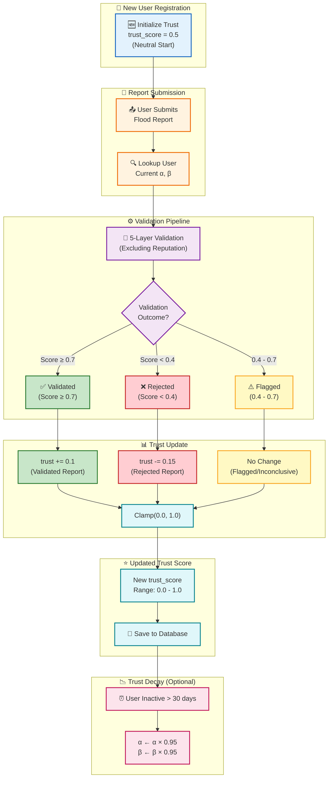
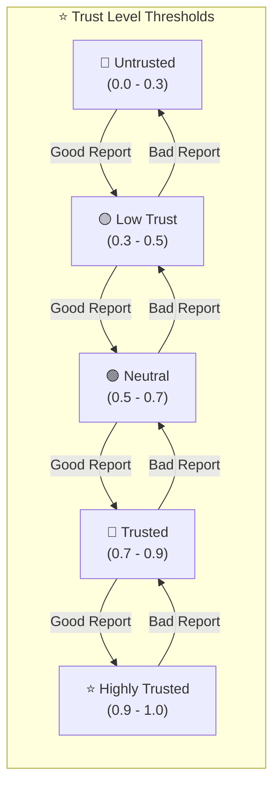

# Diagram 9: Trust Score Computation Flow

Detailed diagram of the simplified trust score system that tracks user reputation based on report validation outcomes.

## Mermaid Code


```mermaid
flowchart TD
    subgraph NewUser["👤 New User Registration"]
        INIT["🆕 Initialize Trust<br/>trust_score = 0.5<br/>(Neutral Start)"]
    end

    subgraph ReportSubmission["📝 Report Submission"]
        SUBMIT["📤 User Submits<br/>Flood Report"]
        LOOKUP["🔍 Lookup User<br/>Current α, β"]
    end

    subgraph ValidationResult["⚙️ Validation Pipeline"]
        VALIDATE["🤖 5-Layer Validation<br/>(Excluding Reputation)"]
        
        OUTCOME{"Validation<br/>Outcome?"}
        CORRECT["✅ Validated<br/>(Score ≥ 0.7)"]
        INCORRECT["❌ Rejected<br/>(Score < 0.4)"]
        NEUTRAL["⚠️ Flagged<br/>(0.4 - 0.7)"]
    end

    subgraph TrustUpdate["📊 Trust Update"]
        UPDATE_UP["trust += 0.1<br/>(Validated Report)"]
        UPDATE_DOWN["trust -= 0.15<br/>(Rejected Report)"]
        NO_UPDATE["No Change<br/>(Flagged/Inconclusive)"]
        
        CLAMP["Clamp(0.0, 1.0)"]
    end

    subgraph TrustScore["⭐ Updated Trust Score"]
        NEW_SCORE["New trust_score<br/>Range: 0.0 - 1.0"]
        SAVE["💾 Save to Database"]
    end

    subgraph Decay["📉 Trust Decay (Optional)"]
        INACTIVE["⏰ User Inactive > 30 days"]
        DECAY_CALC["α ← α × 0.95<br/>β ← β × 0.95"]
    end

    %% Main Flow
    INIT --> SUBMIT
    SUBMIT --> LOOKUP
    LOOKUP --> VALIDATE
    VALIDATE --> OUTCOME
    
    OUTCOME -->|"Score ≥ 0.7"| CORRECT
    OUTCOME -->|"Score < 0.4"| INCORRECT
    OUTCOME -->|"0.4 - 0.7"| NEUTRAL
    
    CORRECT --> UPDATE_UP
    INCORRECT --> UPDATE_DOWN
    NEUTRAL --> NO_UPDATE
    
    UPDATE_UP --> CLAMP
    UPDATE_DOWN --> CLAMP
    NO_UPDATE --> CLAMP
    
    CLAMP --> NEW_SCORE
    NEW_SCORE --> SAVE
    
    SAVE --> INACTIVE
    INACTIVE --> DECAY_CALC

    %% Styling
    classDef initNode fill:#e3f2fd,stroke:#1565c0,stroke-width:2px
    classDef submitNode fill:#fff3e0,stroke:#ef6c00,stroke-width:2px
    classDef validateNode fill:#f3e5f5,stroke:#7b1fa2,stroke-width:2px
    classDef successNode fill:#c8e6c9,stroke:#2e7d32,stroke-width:2px
    classDef failNode fill:#ffcdd2,stroke:#c62828,stroke-width:2px
    classDef neutralNode fill:#fff9c4,stroke:#f9a825,stroke-width:2px
    classDef bayesNode fill:#e0f7fa,stroke:#00838f,stroke-width:2px
    classDef decayNode fill:#fce4ec,stroke:#c2185b,stroke-width:2px

    class INIT initNode
    class SUBMIT,LOOKUP submitNode
    class VALIDATE,OUTCOME validateNode
    class CORRECT,UPDATE_UP successNode
    class INCORRECT,UPDATE_DOWN failNode
    class NEUTRAL,NO_UPDATE neutralNode
    class CLAMP,NEW_SCORE,SAVE bayesNode
    class INACTIVE,DECAY_CALC decayNode
```

## Mathematical Foundation

### Simplified Trust Scoring

The trust system uses **increment/decrement** scoring:

$$
\text{Trust}_{new} = \text{clamp}(\text{Trust}_{old} + \Delta, 0, 1)
$$

Where:
- $\Delta = +0.1$ for validated reports
- $\Delta = -0.15$ for rejected reports
- $\Delta = 0$ for flagged reports

### Update Rules

| Event | Delta | Effect on Trust |
|-------|--------|-----------------|
| Report Validated | +0.10 | Trust ↑ |
| Report Rejected | -0.15 | Trust ↓ |
| Report Flagged | 0 | Trust unchanged |

### Trust Score Interpretation


```mermaid
flowchart LR
    subgraph TrustLevels["⭐ Trust Level Thresholds"]
        T1["🔴 Untrusted<br/>(0.0 - 0.3)"]
        T2["🟡 Low Trust<br/>(0.3 - 0.5)"]
        T3["🟢 Neutral<br/>(0.5 - 0.7)"]
        T4["🔵 Trusted<br/>(0.7 - 0.9)"]
        T5["⭐ Highly Trusted<br/>(0.9 - 1.0)"]
    end

    T1 --> |"Good Report"| T2
    T2 --> |"Good Report"| T3
    T3 --> |"Good Report"| T4
    T4 --> |"Good Report"| T5
    
    T5 --> |"Bad Report"| T4
    T4 --> |"Bad Report"| T3
    T3 --> |"Bad Report"| T2
    T2 --> |"Bad Report"| T1
```

## Example Progression

| Reports | Validated | Rejected | α | β | Trust Score |
|---------|-----------|----------|---|---|-------------|
| 0 | 0 | 0 | 1 | 1 | 0.50 |
| 5 | 4 | 1 | 5 | 2 | 0.71 |
| 10 | 8 | 2 | 9 | 3 | 0.75 |
| 20 | 18 | 2 | 19 | 3 | 0.86 |
| 50 | 45 | 5 | 46 | 6 | 0.88 |

## Python Implementation

```python
class SimpleTrust:
    TRUST_INCREMENT = 0.1
    TRUST_DECREMENT = 0.15
    
    def __init__(self, score: float = 0.5):
        self.trust_score = score
    
    def update(self, validated: bool) -> float:
        if validated:
            self.trust_score += self.TRUST_INCREMENT
        else:
            self.trust_score -= self.TRUST_DECREMENT
        self.trust_score = max(0.0, min(1.0, self.trust_score))
        return self.trust_score
```
