# Diagram 9: Trust Score Computation Flow

Detailed diagram of the Bayesian trust score system that tracks user reputation based on their historical report accuracy.

## Mermaid Code

```mermaid
flowchart TD
    subgraph NewUser["👤 New User Registration"]
        INIT["🆕 Initialize Trust<br/>α = 1.0, β = 1.0<br/>trust_score = 0.5"]
    end

    subgraph ReportSubmission["📝 Report Submission"]
        SUBMIT["📤 User Submits<br/>Flood Report"]
        LOOKUP["🔍 Lookup User<br/>Current α, β"]
    end

    subgraph ValidationResult["⚙️ Validation Pipeline"]
        VALIDATE["🤖 5-Layer Validation<br/>(Excluding Reputation)"]
        
        OUTCOME{"Validation<br/>Outcome?"}
        CORRECT["✅ Validated<br/>(Score ≥ 0.7)"]
        INCORRECT["❌ Rejected<br/>(Score < 0.4)"]
        NEUTRAL["⚠️ Flagged<br/>(0.4 - 0.7)"]
    end

    subgraph BayesianUpdate["🎲 Bayesian Update"]
        UPDATE_ALPHA["α ← α + 1<br/>(Successful Report)"]
        UPDATE_BETA["β ← β + 1<br/>(Failed Report)"]
        NO_UPDATE["No Change<br/>(Inconclusive)"]
        
        CALC_TRUST["📊 Trust = α / (α + β)"]
    end

    subgraph TrustScore["⭐ Updated Trust Score"]
        NEW_SCORE["New trust_score<br/>Range: 0.0 - 1.0"]
        SAVE["💾 Save to Database"]
    end

    subgraph Decay["📉 Trust Decay (Optional)"]
        INACTIVE["⏰ User Inactive > 30 days"]
        DECAY_CALC["α ← α × 0.95<br/>β ← β × 0.95"]
    end

    %% Main Flow
    INIT --> SUBMIT
    SUBMIT --> LOOKUP
    LOOKUP --> VALIDATE
    VALIDATE --> OUTCOME
    
    OUTCOME -->|"Score ≥ 0.7"| CORRECT
    OUTCOME -->|"Score < 0.4"| INCORRECT
    OUTCOME -->|"0.4 - 0.7"| NEUTRAL
    
    CORRECT --> UPDATE_ALPHA
    INCORRECT --> UPDATE_BETA
    NEUTRAL --> NO_UPDATE
    
    UPDATE_ALPHA --> CALC_TRUST
    UPDATE_BETA --> CALC_TRUST
    NO_UPDATE --> CALC_TRUST
    
    CALC_TRUST --> NEW_SCORE
    NEW_SCORE --> SAVE
    
    SAVE --> INACTIVE
    INACTIVE --> DECAY_CALC

    %% Styling
    classDef initNode fill:#e3f2fd,stroke:#1565c0,stroke-width:2px
    classDef submitNode fill:#fff3e0,stroke:#ef6c00,stroke-width:2px
    classDef validateNode fill:#f3e5f5,stroke:#7b1fa2,stroke-width:2px
    classDef successNode fill:#c8e6c9,stroke:#2e7d32,stroke-width:2px
    classDef failNode fill:#ffcdd2,stroke:#c62828,stroke-width:2px
    classDef neutralNode fill:#fff9c4,stroke:#f9a825,stroke-width:2px
    classDef bayesNode fill:#e0f7fa,stroke:#00838f,stroke-width:2px
    classDef decayNode fill:#fce4ec,stroke:#c2185b,stroke-width:2px

    class INIT initNode
    class SUBMIT,LOOKUP submitNode
    class VALIDATE,OUTCOME validateNode
    class CORRECT,UPDATE_ALPHA successNode
    class INCORRECT,UPDATE_BETA failNode
    class NEUTRAL,NO_UPDATE neutralNode
    class CALC_TRUST,NEW_SCORE,SAVE bayesNode
    class INACTIVE,DECAY_CALC decayNode
```



## Mathematical Foundation

### Beta Distribution Prior

The trust system uses a **Beta-Binomial** model:

$$
\text{Trust}(u) = \frac{\alpha_u}{\alpha_u + \beta_u}
$$

Where:
- $\alpha_u$ = Number of validated reports + 1 (prior)
- $\beta_u$ = Number of rejected reports + 1 (prior)

### Update Rules

| Event | Update | Effect on Trust |
|-------|--------|-----------------|
| Report Validated | α ← α + 1 | Trust ↑ |
| Report Rejected | β ← β + 1 | Trust ↓ |
| Report Flagged | No change | Trust unchanged |

### Trust Score Interpretation

```mermaid
flowchart LR
    subgraph TrustLevels["⭐ Trust Level Thresholds"]
        T1["🔴 Untrusted<br/>(0.0 - 0.3)"]
        T2["🟡 Low Trust<br/>(0.3 - 0.5)"]
        T3["🟢 Neutral<br/>(0.5 - 0.7)"]
        T4["🔵 Trusted<br/>(0.7 - 0.9)"]
        T5["⭐ Highly Trusted<br/>(0.9 - 1.0)"]
    end

    T1 --> |"Good Report"| T2
    T2 --> |"Good Report"| T3
    T3 --> |"Good Report"| T4
    T4 --> |"Good Report"| T5
    
    T5 --> |"Bad Report"| T4
    T4 --> |"Bad Report"| T3
    T3 --> |"Bad Report"| T2
    T2 --> |"Bad Report"| T1
```



## Example Progression

| Reports | Validated | Rejected | α | β | Trust Score |
|---------|-----------|----------|---|---|-------------|
| 0 | 0 | 0 | 1 | 1 | 0.50 |
| 5 | 4 | 1 | 5 | 2 | 0.71 |
| 10 | 8 | 2 | 9 | 3 | 0.75 |
| 20 | 18 | 2 | 19 | 3 | 0.86 |
| 50 | 45 | 5 | 46 | 6 | 0.88 |

## Python Implementation

```python
class BayesianTrust:
    def __init__(self, alpha: float = 1.0, beta: float = 1.0):
        self.alpha = alpha
        self.beta = beta
    
    @property
    def trust_score(self) -> float:
        return self.alpha / (self.alpha + self.beta)
    
    def update(self, validated: bool) -> float:
        if validated:
            self.alpha += 1
        else:
            self.beta += 1
        return self.trust_score
    
    def decay(self, factor: float = 0.95):
        """Apply time-based decay for inactive users."""
        self.alpha *= factor
        self.beta *= factor
```
