# Diagram 10: User Journey

End-to-end user experience flow showing how citizens interact with the flood validation system.

## Mermaid Code

## Alternative: Detailed User Flow

```mermaid
flowchart TD
    subgraph Discovery["📱 Discovery Phase"]
        A1["👂 Hear about app<br/>(News/Social Media)"]
        A2["📲 Open PWA Link<br/>(No app store needed)"]
        A3["💾 Install to Home Screen"]
    end

    subgraph Auth["🔐 Authentication"]
        B1["📞 Enter Phone Number"]
        B2["📨 Receive OTP SMS"]
        B3["✅ Verify & Create Account"]
        B4["👤 New User Created<br/>(trust_score = 0.5)"]
    end

    subgraph Report["📝 Report Submission"]
        C1["🗺️ View Flood Map"]
        C2["➕ Tap 'Report Flood'"]
        C3["📍 GPS Auto-Detect Location<br/>(with manual override)"]
        C4["📸 Capture/Upload Photo"]
        C5["📏 Select Water Depth<br/>(slider: 0-3m)"]
        C6["📝 Add Description<br/>(optional)"]
        C7["📤 Submit Report"]
    end

    subgraph Processing["⚙️ Backend Processing"]
        D1["🔄 Show Loading State"]
        D2["🧠 5-Layer Validation"]
        D3["📊 Compute Final Score"]
        D4{"Score ≥ 0.7?"}
        D5["✅ Mark Validated"]
        D6["⚠️ Mark Flagged"]
    end

    subgraph Feedback["📣 User Feedback"]
        E1["🔔 Push Notification<br/>'Report Validated!'"]
        E2["🗺️ See on Map<br/>(with confidence badge)"]
        E3["⭐ Trust Score Updated"]
        E4["📊 View Personal Stats"]
    end

    subgraph Community["🌍 Community Impact"]
        F1["⚠️ Alert Others Nearby"]
        F2["📡 Data to OSDMA"]
        F3["🚨 Emergency Response"]
    end

    %% Flow
    A1 --> A2 --> A3
    A3 --> B1 --> B2 --> B3 --> B4
    B4 --> C1
    
    C1 --> C2 --> C3 --> C4 --> C5 --> C6 --> C7
    
    C7 --> D1 --> D2 --> D3 --> D4
    D4 -->|"Yes"| D5
    D4 -->|"No"| D6
    
    D5 --> E1
    D6 --> E1
    E1 --> E2 --> E3 --> E4
    
    D5 --> F1 --> F2 --> F3

    %% Styling
    classDef discoveryNode fill:#e3f2fd,stroke:#1565c0,stroke-width:2px
    classDef authNode fill:#fff3e0,stroke:#ef6c00,stroke-width:2px
    classDef reportNode fill:#e8f5e9,stroke:#2e7d32,stroke-width:2px
    classDef processNode fill:#f3e5f5,stroke:#7b1fa2,stroke-width:2px
    classDef feedbackNode fill:#fce4ec,stroke:#c2185b,stroke-width:2px
    classDef communityNode fill:#e0f7fa,stroke:#00838f,stroke-width:2px

    class A1,A2,A3 discoveryNode
    class B1,B2,B3,B4 authNode
    class C1,C2,C3,C4,C5,C6,C7 reportNode
    class D1,D2,D3,D4,D5,D6 processNode
    class E1,E2,E3,E4 feedbackNode
    class F1,F2,F3 communityNode
```

## Mobile App Screens

```mermaid
flowchart LR
    subgraph Screens["📱 App Screens"]
        S1["🏠 Home<br/>(Map View)"]
        S2["📝 Report Form"]
        S3["📷 Camera"]
        S4["📊 My Reports"]
        S5["⚙️ Settings"]
    end

    S1 -->|"FAB +"| S2
    S2 -->|"Add Photo"| S3
    S3 -->|"Capture"| S2
    S2 -->|"Submit"| S1
    S1 -->|"Profile"| S4
    S1 -->|"Settings"| S5
```

## Accessibility Considerations

| Feature | Implementation |
|---------|---------------|
| **Offline Support** | PWA caches map tiles, queues reports |
| **Low Bandwidth** | Compressed images, minimal data |
| **Multi-language** | Odia, Hindi, English |
| **Screen Reader** | ARIA labels on all buttons |
| **Low Vision** | High contrast mode available |
