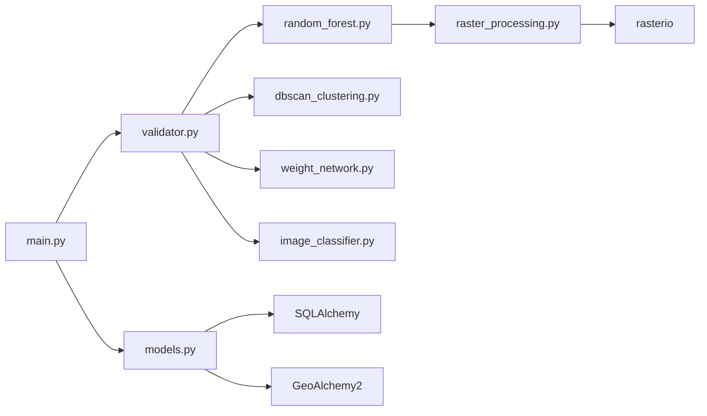

# Diagram 11: Component Dependency Graph

Module relationships within the codebase showing how different components depend on each other.

## Mermaid Code

```mermaid
flowchart TD
    subgraph API["📡 src/api/"]
        MAIN["main.py<br/>(FastAPI App)"]
        MODELS["models.py<br/>(SQLAlchemy ORM)"]
        SCHEMAS["schemas.py<br/>(Pydantic)"]
        DATABASE["database.py<br/>(Connection)"]
    end

    subgraph Validation["🔍 src/validation/"]
        VALIDATOR["validator.py<br/>(5-Layer Engine)"]
    end

    subgraph ML["🧠 src/ml/"]
        subgraph MLModels["models/"]
            RF["random_forest.py"]
            DBSCAN_M["dbscan_clustering.py"]
            WEIGHT["weight_network.py"]
            IMG_CLS["image_classifier.py"]
            LGB["lightgbm_ensemble.py"]
            XGB_M["xgboost_model.py"]
        end
        
        EVAL["evaluation.py<br/>(Metrics)"]
    end

    subgraph Preprocessing["⚙️ src/preprocessing/"]
        RASTER["raster_processing.py<br/>(DEM/HAND/Slope)"]
        SPATIAL["spatial_features.py<br/>(PostGIS Queries)"]
    end

    subgraph Utils["🔧 src/utils/"]
        GEO["geo_utils.py"]
        LOGGER["logger.py"]
        CONFIG["config.py"]
    end

    subgraph External["📦 External Dependencies"]
        FASTAPI_DEP["fastapi"]
        SQLALCHEMY["sqlalchemy"]
        GEOALCHEMY["geoalchemy2"]
        RASTERIO["rasterio"]
        SKLEARN["scikit-learn"]
        TORCH["pytorch"]
        KAFKA["kafka-python"]
    end

    subgraph Data["💾 data/"]
        DEM["dem_30m.tif"]
        HAND["hand_index.tif"]
        SLOPE["slope.tif"]
    end

    subgraph Models["🗂️ models/"]
        RF_PKL["rf_physical.pkl"]
        LGB_TXT["lgb_ensemble.txt"]
        WEIGHT_JSON["weight_network.json"]
    end

    %% API Dependencies
    MAIN --> MODELS
    MAIN --> SCHEMAS
    MAIN --> DATABASE
    MAIN --> VALIDATOR
    MAIN --> IMG_CLS
    MODELS --> DATABASE
    
    %% Validator Dependencies
    VALIDATOR --> RF
    VALIDATOR --> DBSCAN_M
    VALIDATOR --> WEIGHT
    VALIDATOR --> IMG_CLS
    VALIDATOR --> RASTER
    VALIDATOR --> SPATIAL
    
    %% ML Model Dependencies
    RF --> SKLEARN
    DBSCAN_M --> SKLEARN
    LGB --> SKLEARN
    XGB_M --> SKLEARN
    IMG_CLS --> TORCH
    WEIGHT --> SKLEARN
    EVAL --> SKLEARN
    
    %% Preprocessing Dependencies
    RASTER --> RASTERIO
    RASTER --> DEM
    RASTER --> HAND
    RASTER --> SLOPE
    SPATIAL --> GEOALCHEMY
    
    %% Model Loading
    RF --> RF_PKL
    LGB --> LGB_TXT
    WEIGHT --> WEIGHT_JSON
    
    %% External dependencies
    MAIN --> FASTAPI_DEP
    DATABASE --> SQLALCHEMY
    MODELS --> GEOALCHEMY
    
    %% Utility usage
    VALIDATOR --> LOGGER
    MAIN --> CONFIG
    RASTER --> GEO

    %% Styling
    classDef apiNode fill:#e3f2fd,stroke:#1565c0,stroke-width:2px
    classDef validNode fill:#e8f5e9,stroke:#2e7d32,stroke-width:2px
    classDef mlNode fill:#f3e5f5,stroke:#7b1fa2,stroke-width:2px
    classDef preNode fill:#fff3e0,stroke:#ef6c00,stroke-width:2px
    classDef utilNode fill:#fce4ec,stroke:#c2185b,stroke-width:2px
    classDef extNode fill:#e0f7fa,stroke:#00838f,stroke-width:2px
    classDef dataNode fill:#fff8e1,stroke:#f9a825,stroke-width:2px

    class MAIN,MODELS,SCHEMAS,DATABASE apiNode
    class VALIDATOR validNode
    class RF,DBSCAN_M,WEIGHT,IMG_CLS,LGB,XGB_M,EVAL mlNode
    class RASTER,SPATIAL preNode
    class GEO,LOGGER,CONFIG utilNode
    class FASTAPI_DEP,SQLALCHEMY,GEOALCHEMY,RASTERIO,SKLEARN,TORCH,KAFKA extNode
    class DEM,HAND,SLOPE,RF_PKL,LGB_TXT,WEIGHT_JSON dataNode
```



## Import Graph (Simplified)



## Package Structure

```
src/
├── api/
│   ├── __init__.py
│   ├── main.py           # FastAPI application entry
│   ├── models.py         # SQLAlchemy ORM models
│   ├── schemas.py        # Pydantic validation schemas
│   └── database.py       # Database connection
├── ml/
│   ├── models/
│   │   ├── random_forest.py      # Physical plausibility
│   │   ├── dbscan_clustering.py  # Spatial analysis
│   │   ├── weight_network.py     # Adaptive weighting
│   │   ├── image_classifier.py   # CNN flood detection
│   │   ├── lightgbm_ensemble.py  # Gradient boosting
│   │   └── xgboost_model.py      # Alternative ensemble
│   ├── training/
│   │   └── train_models.py
│   └── evaluation.py
├── preprocessing/
│   ├── raster_processing.py  # DEM/HAND/Slope
│   └── spatial_features.py   # PostGIS queries
├── validation/
│   └── validator.py      # 5-Layer validation engine
└── utils/
    ├── geo_utils.py
    ├── logger.py
    └── config.py
```
