# Diagram 12: Weight Learning Network Architecture

How the system dynamically learns optimal layer weights from ground truth data to improve validation accuracy.

## Mermaid Code

```mermaid
flowchart TD
    subgraph TrainingData["📊 Training Data Preparation"]
        GT["🛰️ Ground Truth<br/>(SAR Flood Extent)"]
        REPORTS["📝 Historical Reports<br/>(with validation outcomes)"]
        LABELS["🏷️ Binary Labels<br/>(1=True Flood, 0=False)"]
        
        GT --> LABELS
        REPORTS --> LABELS
    end

    subgraph FeatureExtraction["⚙️ Layer Score Extraction"]
        L1_FEAT["Layer 1: Physical<br/>(RF Score)"]
        L2_FEAT["Layer 2: Statistical<br/>(DBSCAN Score)"]
        L3_FEAT["Layer 3: Reputation<br/>(Trust Score)"]
        L4_FEAT["Layer 4: Social<br/>(News Score)"]
        L5_FEAT["Layer 5: Vision<br/>(CNN Score)"]
        
        FEATURE_VEC["Feature Vector<br/>[s1, s2, s3, s4, s5]"]
        
        L1_FEAT --> FEATURE_VEC
        L2_FEAT --> FEATURE_VEC
        L3_FEAT --> FEATURE_VEC
        L4_FEAT --> FEATURE_VEC
        L5_FEAT --> FEATURE_VEC
    end

    subgraph Optimization["🎯 Weight Optimization"]
        INIT_W["Initial Weights<br/>[0.35, 0.25, 0.20, 0.10, 0.10]"]
        
        subgraph OptLoop["Optimization Loop"]
            PREDICT["Predict: Σ(wᵢ × sᵢ)"]
            LOSS["Loss: Binary Cross-Entropy"]
            GRADIENT["Gradient-Free Optimizer<br/>(Nelder-Mead / COBYLA)"]
            UPDATE["Update Weights"]
            
            PREDICT --> LOSS
            LOSS --> GRADIENT
            GRADIENT --> UPDATE
            UPDATE --> PREDICT
        end
        
        CONSTRAINT["Constraint: Σwᵢ = 1"]
        FINAL_W["Optimized Weights<br/>[w1*, w2*, w3*, w4*, w5*]"]
        
        INIT_W --> OptLoop
        CONSTRAINT --> OptLoop
        OptLoop --> FINAL_W
    end

    subgraph Evaluation["📈 Weight Evaluation"]
        CROSS_VAL["5-Fold Cross-Validation"]
        METRICS["Compute Metrics<br/>(Accuracy, F1, AUC)"]
        COMPARE["Compare to Default<br/>Weights Baseline"]
        
        FINAL_W --> CROSS_VAL
        CROSS_VAL --> METRICS
        METRICS --> COMPARE
    end

    subgraph Deployment["🚀 Deployment"]
        SAVE["💾 Save to<br/>weight_network.json"]
        LOAD["📥 Load in Validator"]
        PRODUCTION["🌐 Production Use"]
        
        FINAL_W --> SAVE
        SAVE --> LOAD
        LOAD --> PRODUCTION
    end

    %% Connections
    LABELS --> FeatureExtraction
    FEATURE_VEC --> Optimization

    %% Styling
    classDef dataNode fill:#e3f2fd,stroke:#1565c0,stroke-width:2px
    classDef featNode fill:#e8f5e9,stroke:#2e7d32,stroke-width:2px
    classDef optNode fill:#f3e5f5,stroke:#7b1fa2,stroke-width:2px
    classDef evalNode fill:#fff3e0,stroke:#ef6c00,stroke-width:2px
    classDef deployNode fill:#fce4ec,stroke:#c2185b,stroke-width:2px

    class GT,REPORTS,LABELS dataNode
    class L1_FEAT,L2_FEAT,L3_FEAT,L4_FEAT,L5_FEAT,FEATURE_VEC featNode
    class INIT_W,PREDICT,LOSS,GRADIENT,UPDATE,CONSTRAINT,FINAL_W optNode
    class CROSS_VAL,METRICS,COMPARE evalNode
    class SAVE,LOAD,PRODUCTION deployNode
```



## Weight Network JSON Format

```json
{
  "weights": {
    "physical": 0.32,
    "statistical": 0.28,
    "reputation": 0.18,
    "social": 0.12,
    "vision": 0.10
  },
  "trained_on": "2024-01-15",
  "samples": 1250,
  "performance": {
    "accuracy": 0.87,
    "f1_score": 0.84,
    "auc_roc": 0.91
  }
}
```

## Optimization Algorithm


## Mathematical Formulation

### Objective Function

$$
\min_{w} \mathcal{L}(w) = -\frac{1}{N} \sum_{i=1}^{N} \left[ y_i \log(\hat{y}_i) + (1-y_i) \log(1-\hat{y}_i) \right]
$$

Where:
- $\hat{y}_i = \sigma\left(\sum_{j=1}^{5} w_j \cdot s_{ij}\right)$ (predicted probability)
- $y_i \in \{0, 1\}$ (ground truth label)
- $s_{ij}$ = Score from layer $j$ for sample $i$

### Constraints

$$
\sum_{j=1}^{5} w_j = 1, \quad w_j \geq 0 \quad \forall j
$$

## Python Implementation

```python
from scipy.optimize import minimize

class WeightLearningNetwork:
    def __init__(self, initial_weights=None):
        self.weights = initial_weights or [0.35, 0.25, 0.20, 0.10, 0.10]
    
    def _loss(self, weights, X, y):
        """Binary cross-entropy loss."""
        predictions = np.dot(X, weights)
        predictions = np.clip(predictions, 1e-7, 1 - 1e-7)
        return -np.mean(y * np.log(predictions) + (1-y) * np.log(1-predictions))
    
    def train(self, layer_scores: np.ndarray, labels: np.ndarray):
        """Train weights using Nelder-Mead optimization."""
        constraints = {'type': 'eq', 'fun': lambda w: np.sum(w) - 1}
        bounds = [(0, 1) for _ in range(5)]
        
        result = minimize(
            self._loss,
            x0=self.weights,
            args=(layer_scores, labels),
            method='SLSQP',
            bounds=bounds,
            constraints=constraints
        )
        
        self.weights = result.x
        return dict(zip(
            ['physical', 'statistical', 'reputation', 'social', 'vision'],
            self.weights
        ))
```
