# Diagram 13: Geospatial Data Processing Pipeline

How DEM, HAND, and Slope raster data is processed for flood feasibility analysis.

## Mermaid Code

```mermaid
flowchart TD
    subgraph RawData["📥 Raw Geospatial Data"]
        SRTM["🛰️ SRTM DEM<br/>(30m Resolution)"]
        DRAINAGE["🌊 Stream Network<br/>(HydroSHEDS)"]
        LULC["🗺️ Land Use/Cover<br/>(ISRO Bhuvan)"]
    end

    subgraph WhiteboxTools["⚙️ WhiteboxTools Processing"]
        FILL["Fill Depressions<br/>(breach_depressions)"]
        FLOW_DIR["Flow Direction<br/>(d8_pointer)"]
        FLOW_ACC["Flow Accumulation<br/>(d8_flow_accumulation)"]
        STREAMS["Extract Streams<br/>(threshold > 1000)"]
        SLOPE_CALC["Slope Calculation<br/>(slope)"]
        HAND_CALC["HAND Index<br/>(elevation_above_stream)"]
    end

    subgraph ProcessedRasters["📊 Processed Rasters"]
        DEM_FILLED["dem_filled.tif<br/>(Hydrologically Corrected)"]
        SLOPE_TIF["slope.tif<br/>(Degrees 0-90)"]
        HAND_TIF["hand.tif<br/>(Meters Above Stream)"]
        STREAM_TIF["streams.tif<br/>(Binary Mask)"]
    end

    subgraph Integration["🔗 PostGIS Integration"]
        RASTER2PGSQL["raster2pgsql<br/>(Import to DB)"]
        SPATIAL_INDEX["Create Spatial Index<br/>(GIST)"]
        QUERY_FUNC["ST_Value Function<br/>(Point Extraction)"]
    end

    subgraph Validation["✅ Use in Validation"]
        POINT_QUERY["Report Location<br/>(lat, lon)"]
        EXTRACT["Extract Values:<br/>- Elevation<br/>- HAND<br/>- Slope"]
        FEATURES["Feature Vector<br/>(Physical Layer)"]
    end

    %% Processing Flow
    SRTM --> FILL
    FILL --> DEM_FILLED
    DEM_FILLED --> FLOW_DIR
    FLOW_DIR --> FLOW_ACC
    FLOW_ACC --> STREAMS
    STREAMS --> STREAM_TIF
    
    DEM_FILLED --> SLOPE_CALC
    SLOPE_CALC --> SLOPE_TIF
    
    DEM_FILLED --> HAND_CALC
    STREAM_TIF --> HAND_CALC
    HAND_CALC --> HAND_TIF

    %% PostGIS Integration
    DEM_FILLED --> RASTER2PGSQL
    SLOPE_TIF --> RASTER2PGSQL
    HAND_TIF --> RASTER2PGSQL
    RASTER2PGSQL --> SPATIAL_INDEX
    SPATIAL_INDEX --> QUERY_FUNC

    %% Validation Use
    POINT_QUERY --> QUERY_FUNC
    QUERY_FUNC --> EXTRACT
    EXTRACT --> FEATURES

    %% Styling
    classDef rawNode fill:#e3f2fd,stroke:#1565c0,stroke-width:2px
    classDef toolNode fill:#fff3e0,stroke:#ef6c00,stroke-width:2px
    classDef rasterNode fill:#e8f5e9,stroke:#2e7d32,stroke-width:2px
    classDef dbNode fill:#f3e5f5,stroke:#7b1fa2,stroke-width:2px
    classDef validNode fill:#fce4ec,stroke:#c2185b,stroke-width:2px

    class SRTM,DRAINAGE,LULC rawNode
    class FILL,FLOW_DIR,FLOW_ACC,STREAMS,SLOPE_CALC,HAND_CALC toolNode
    class DEM_FILLED,SLOPE_TIF,HAND_TIF,STREAM_TIF rasterNode
    class RASTER2PGSQL,SPATIAL_INDEX,QUERY_FUNC dbNode
    class POINT_QUERY,EXTRACT,FEATURES validNode
```



## HAND Index Explanation

```mermaid
flowchart LR
    subgraph HANDConcept["Height Above Nearest Drainage (HAND)"]
        ELEV["Point Elevation<br/>(from DEM)"]
        STREAM_ELEV["Nearest Stream<br/>Elevation"]
        HAND_VAL["HAND = Elev - Stream_Elev"]
    end

    subgraph Interpretation["🌊 Flood Risk"]
        LOW["HAND < 5m<br/>🔴 High Risk"]
        MED["HAND 5-15m<br/>🟡 Medium Risk"]
        HIGH["HAND > 15m<br/>🟢 Low Risk"]
    end

    ELEV --> HAND_VAL
    STREAM_ELEV --> HAND_VAL
    HAND_VAL --> LOW
    HAND_VAL --> MED
    HAND_VAL --> HIGH
```



## WhiteboxTools Commands

```bash
# 1. Fill DEM depressions
whitebox_tools -r=BreachDepressionsLeastCost \
    -i=dem_raw.tif \
    -o=dem_filled.tif

# 2. Flow Direction
whitebox_tools -r=D8Pointer \
    -i=dem_filled.tif \
    -o=flow_dir.tif

# 3. Flow Accumulation  
whitebox_tools -r=D8FlowAccumulation \
    --dem=dem_filled.tif \
    -o=flow_acc.tif

# 4. Extract Streams (threshold 1000 cells)
whitebox_tools -r=ExtractStreams \
    --flow_accum=flow_acc.tif \
    -o=streams.tif \
    --threshold=1000

# 5. Calculate Slope
whitebox_tools -r=Slope \
    -i=dem_filled.tif \
    -o=slope.tif \
    --units=Degrees

# 6. Calculate HAND
whitebox_tools -r=ElevationAboveStream \
    --dem=dem_filled.tif \
    --streams=streams.tif \
    -o=hand.tif
```
