# Diagram 14: DBSCAN Spatial Clustering Algorithm

How the DBSCAN algorithm clusters nearby flood reports for statistical validation (Layer 2).

## Mermaid Code

```mermaid
flowchart TD
    subgraph Input["📥 Input Data"]
        REPORTS["📍 Recent Flood Reports<br/>(within 24 hours)"]
        TARGET["🎯 Target Report<br/>(being validated)"]
        COORDS["Coordinates Matrix<br/>[[lat1,lon1], [lat2,lon2], ...]"]
    end

    subgraph Parameters["⚙️ DBSCAN Parameters"]
        EPS["eps = 1000m<br/>(Neighborhood Radius)"]
        MIN_SAMPLES["min_samples = 3<br/>(Core Point Threshold)"]
        METRIC["metric = 'haversine'<br/>(Great Circle Distance)"]
    end

    subgraph Algorithm["🔬 DBSCAN Execution"]
        DISTANCE["1️⃣ Compute Distance Matrix<br/>(Haversine)"]
        NEIGHBORS["2️⃣ Find ε-Neighbors<br/>(within 1km)"]
        CORE{"3️⃣ Core Point?<br/>(≥3 neighbors)"}
        EXPAND["4️⃣ Expand Cluster<br/>(density-reachable)"]
        NOISE["Mark as Noise<br/>(label = -1)"]
        CLUSTER["Assign Cluster<br/>(label = 0, 1, ...)"]
    end

    subgraph Scoring["📊 Consensus Score"]
        TARGET_CLUSTER["Target's Cluster Label"]
        CLUSTER_SIZE["Cluster Size<br/>(member count)"]
        SCORE_CALC["Score = min(size / 10, 1.0)"]
        FINAL_SCORE["Layer 2 Score<br/>(0.0 - 1.0)"]
    end

    %% Flow
    REPORTS --> COORDS
    TARGET --> COORDS
    
    EPS --> DISTANCE
    METRIC --> DISTANCE
    COORDS --> DISTANCE
    
    DISTANCE --> NEIGHBORS
    MIN_SAMPLES --> NEIGHBORS
    NEIGHBORS --> CORE
    
    CORE -->|"Yes"| EXPAND
    CORE -->|"No"| NOISE
    
    EXPAND --> CLUSTER
    
    CLUSTER --> TARGET_CLUSTER
    TARGET_CLUSTER --> CLUSTER_SIZE
    CLUSTER_SIZE --> SCORE_CALC
    SCORE_CALC --> FINAL_SCORE

    %% Styling
    classDef inputNode fill:#e3f2fd,stroke:#1565c0,stroke-width:2px
    classDef paramNode fill:#fff3e0,stroke:#ef6c00,stroke-width:2px
    classDef algoNode fill:#e8f5e9,stroke:#2e7d32,stroke-width:2px
    classDef scoreNode fill:#f3e5f5,stroke:#7b1fa2,stroke-width:2px

    class REPORTS,TARGET,COORDS inputNode
    class EPS,MIN_SAMPLES,METRIC paramNode
    class DISTANCE,NEIGHBORS,CORE,EXPAND,NOISE,CLUSTER algoNode
    class TARGET_CLUSTER,CLUSTER_SIZE,SCORE_CALC,FINAL_SCORE scoreNode
```



## Visual Example

```mermaid
flowchart LR
    subgraph Scenario["🗺️ Spatial Scenario"]
        C1["🔴 Cluster 1<br/>(5 reports)"]
        C2["🔵 Cluster 2<br/>(8 reports)"]
        N1["⚫ Noise<br/>(isolated)"]
        T["🎯 Target<br/>(within Cluster 2)"]
    end

    subgraph Result["📊 Validation Result"]
        R1["Target in Cluster 2"]
        R2["Cluster Size = 8"]
        R3["Score = min(8/10, 1.0) = 0.8"]
        R4["✅ High Consensus"]
    end

    T --> R1 --> R2 --> R3 --> R4
```



## Score Interpretation

| Cluster Size | Score | Interpretation |
|--------------|-------|----------------|
| 0 (Noise) | 0.0 | No corroborating reports |
| 1-2 | 0.1-0.2 | Weak consensus |
| 3-5 | 0.3-0.5 | Moderate consensus |
| 6-9 | 0.6-0.9 | Strong consensus |
| 10+ | 1.0 | Very high consensus |

## Python Implementation

```python
from sklearn.cluster import DBSCAN
import numpy as np

class SpatialAnalyzer:
    def __init__(self, eps_meters: float = 1000, min_samples: int = 3):
        # Convert meters to radians for haversine
        self.eps = eps_meters / 6371000  # Earth radius in meters
        self.min_samples = min_samples
    
    def compute_consensus_score(
        self, 
        target_lat: float, 
        target_lon: float,
        neighbor_coords: np.ndarray
    ) -> dict:
        # Combine target with neighbors
        coords = np.vstack([[target_lat, target_lon], neighbor_coords])
        coords_rad = np.radians(coords)
        
        # Run DBSCAN with haversine metric
        db = DBSCAN(
            eps=self.eps,
            min_samples=self.min_samples,
            metric='haversine'
        ).fit(coords_rad)
        
        # Target's cluster is first element
        target_label = db.labels_[0]
        
        if target_label == -1:
            return {"score": 0.0, "cluster_size": 0, "is_noise": True}
        
        cluster_size = np.sum(db.labels_ == target_label)
        score = min(cluster_size / 10.0, 1.0)
        
        return {
            "score": score,
            "cluster_size": int(cluster_size),
            "cluster_label": int(target_label),
            "n_clusters": len(set(db.labels_)) - (1 if -1 in db.labels_ else 0)
        }
```
