# Diagram 15: Emergency Alert & Notification Flow

How validated flood reports trigger alerts to citizens, emergency responders, and government agencies.

## Mermaid Code

```mermaid
flowchart TD
    subgraph Trigger["⚡ Alert Triggers"]
        VALIDATED["✅ Report Validated<br/>(score ≥ 0.7)"]
        CLUSTER["📊 Cluster Detected<br/>(≥5 reports in 2km)"]
        SEVERITY{"Severity Level?"}
    end

    subgraph SeverityLevels["🚨 Severity Classification"]
        LOW["🟡 LOW<br/>(depth < 0.5m)"]
        MEDIUM["🟠 MEDIUM<br/>(depth 0.5-1.5m)"]
        HIGH["🔴 HIGH<br/>(depth > 1.5m)"]
        CRITICAL["⛔ CRITICAL<br/>(infrastructure risk)"]
    end

    subgraph Channels["📢 Notification Channels"]
        subgraph Citizens["👥 Citizens"]
            PUSH["📱 Push Notification<br/>(Firebase FCM)"]
            SMS_CITIZEN["📱 SMS Alert<br/>(Twilio)"]
            EMAIL["📧 Email Digest"]
        end
        
        subgraph Emergency["🚒 Emergency Services"]
            OSDMA["🏛️ OSDMA Dashboard<br/>(Real-time API)"]
            SMS_RESP["📞 SMS to Responders"]
            WEBHOOK["🔗 Webhook Trigger<br/>(Integration)"]
        end
        
        subgraph Media["📰 Media & Public"]
            TWITTER_POST["🐦 Auto-Tweet<br/>(Official Account)"]
            RSS["📡 RSS Feed<br/>(News Aggregators)"]
        end
    end

    subgraph Targeting["🎯 Geographic Targeting"]
        RADIUS["📍 Affected Radius<br/>(based on severity)"]
        USERS_NEARBY["👤 Users within Radius"]
        GDMA["🏛️ District Authorities"]
    end

    subgraph MessageContent["✉️ Message Template"]
        MSG["🌊 FLOOD ALERT<br/>Location: {district}<br/>Severity: {level}<br/>Depth: {depth}m<br/>Time: {timestamp}"]
    end

    %% Flow
    VALIDATED --> SEVERITY
    CLUSTER --> SEVERITY
    
    SEVERITY -->|"< 0.5m"| LOW
    SEVERITY -->|"0.5-1.5m"| MEDIUM
    SEVERITY -->|"> 1.5m"| HIGH
    SEVERITY -->|"Critical"| CRITICAL
    
    LOW --> PUSH
    LOW --> EMAIL
    
    MEDIUM --> PUSH
    MEDIUM --> SMS_CITIZEN
    MEDIUM --> OSDMA
    
    HIGH --> PUSH
    HIGH --> SMS_CITIZEN
    HIGH --> SMS_RESP
    HIGH --> OSDMA
    HIGH --> WEBHOOK
    
    CRITICAL --> PUSH
    CRITICAL --> SMS_CITIZEN
    CRITICAL --> SMS_RESP
    CRITICAL --> OSDMA
    CRITICAL --> WEBHOOK
    CRITICAL --> TWITTER_POST
    CRITICAL --> RSS
    
    %% Targeting
    SEVERITY --> RADIUS
    RADIUS --> USERS_NEARBY
    RADIUS --> GDMA
    
    USERS_NEARBY --> PUSH
    USERS_NEARBY --> SMS_CITIZEN
    GDMA --> SMS_RESP

    %% Message
    MSG --> PUSH
    MSG --> SMS_CITIZEN
    MSG --> SMS_RESP

    %% Styling
    classDef triggerNode fill:#e3f2fd,stroke:#1565c0,stroke-width:2px
    classDef lowNode fill:#fff9c4,stroke:#f9a825,stroke-width:2px
    classDef medNode fill:#ffe0b2,stroke:#ef6c00,stroke-width:2px
    classDef highNode fill:#ffcdd2,stroke:#c62828,stroke-width:2px
    classDef critNode fill:#f48fb1,stroke:#c2185b,stroke-width:3px
    classDef channelNode fill:#e8f5e9,stroke:#2e7d32,stroke-width:2px
    classDef targetNode fill:#f3e5f5,stroke:#7b1fa2,stroke-width:2px

    class VALIDATED,CLUSTER,SEVERITY triggerNode
    class LOW lowNode
    class MEDIUM medNode
    class HIGH highNode
    class CRITICAL critNode
    class PUSH,SMS_CITIZEN,EMAIL,OSDMA,SMS_RESP,WEBHOOK,TWITTER_POST,RSS channelNode
    class RADIUS,USERS_NEARBY,GDMA targetNode
```



## Alert Radius by Severity

```mermaid
flowchart LR
    subgraph Radius["📍 Alert Radius"]
        R1["🟡 LOW: 500m"]
        R2["🟠 MEDIUM: 2km"]
        R3["🔴 HIGH: 5km"]
        R4["⛔ CRITICAL: 10km+"]
    end
```



## Twilio SMS Integration

```python
from twilio.rest import Client

def send_flood_alert(
    phone_numbers: list,
    location: str,
    severity: str,
    depth: float
):
    client = Client(TWILIO_SID, TWILIO_TOKEN)
    
    message = f"""
🌊 FLOOD ALERT - {severity.upper()}
📍 Location: {location}
💧 Depth: {depth}m
⏰ Time: {datetime.now().strftime('%H:%M')}
🔗 View map: floodwatch.in/alert
"""
    
    for phone in phone_numbers:
        client.messages.create(
            body=message,
            from_=TWILIO_PHONE,
            to=phone
        )
```

## Firebase Push Notification

```javascript
const admin = require('firebase-admin');

async function sendFloodAlert(userTokens, alert) {
  const message = {
    notification: {
      title: `🌊 Flood Alert - ${alert.severity}`,
      body: `${alert.location}: ${alert.depth}m depth reported`
    },
    data: {
      alertId: alert.id,
      latitude: String(alert.lat),
      longitude: String(alert.lon),
      severity: alert.severity
    },
    tokens: userTokens
  };
  
  await admin.messaging().sendMulticast(message);
}
```
