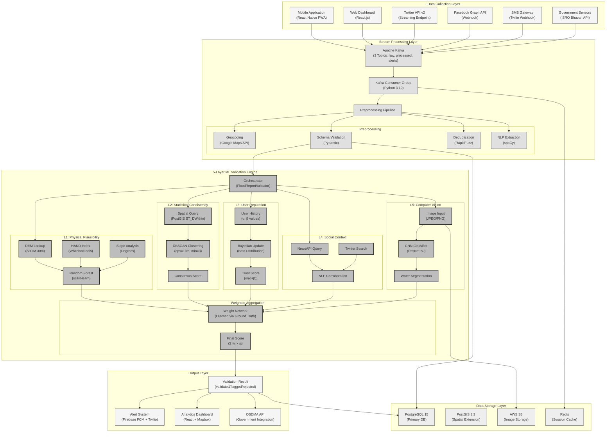
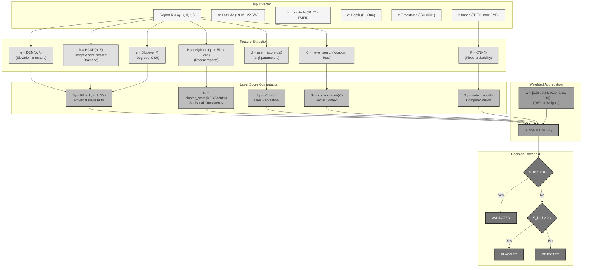
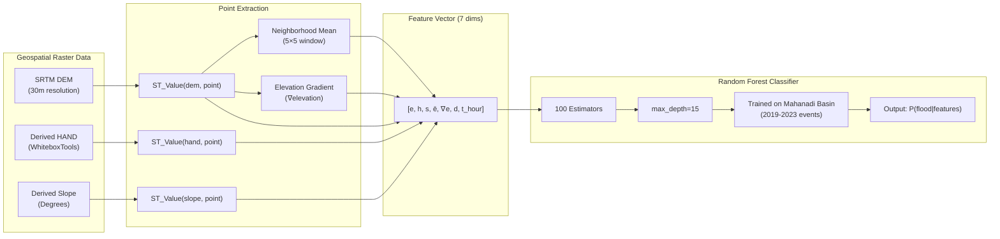
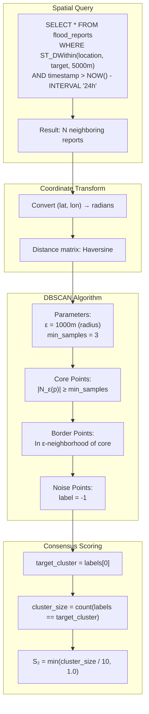
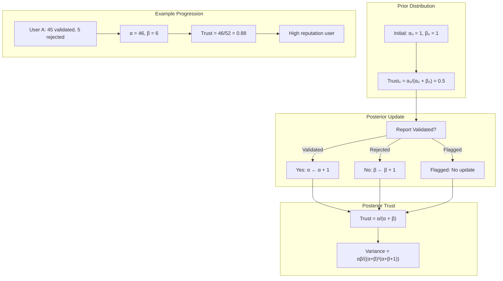

# Diagram 16: Research Paper Figures - Complete Set

A comprehensive set of publication-ready diagrams suitable for inclusion in IEEE/ACM academic papers. These follow strict academic styling with detailed component labeling.

---

## Figure 1: Complete System Architecture (Primary)



---

## Figure 2: Validation Algorithm Detail



---

## Figure 3: Physical Plausibility Layer (L1) Detail



---

## Figure 4: DBSCAN Clustering (L2) Detail



---

## Figure 5: Bayesian Trust Model (L3)



---

## Figure 6: CNN Image Classifier (L5)

```mermaid
flowchart LR
    subgraph Input["Image Input"]
        I1["User Photo<br/>(Variable size JPEG)"]
        I2["Resize: 224×224"]
        I3["Normalize: ImageNet stats"]
    end

    subgraph Backbone["ResNet-50 Backbone"]
        B1["Conv1: 7×7, 64, stride=2"]
        B2["MaxPool: 3×3, stride=2"]
        B3["Layer1: 3 blocks, 256"]
        B4["Layer2: 4 blocks, 512"]
        B5["Layer3: 6 blocks, 1024"]
        B6["Layer4: 3 blocks, 2048"]
        B7["AvgPool: 7×7"]
    end

    subgraph Head["Classification Head"]
        H1["FC: 2048 → 512"]
        H2["ReLU + Dropout(0.3)"]
        H3["FC: 512 → 2"]
        H4["Softmax"]
    end

    subgraph Output["Output"]
        O1["P(flood) = 0.87"]
        O2["P(non-flood) = 0.13"]
        O3["S₅ = P(flood)"]
    end

    I1 --> I2
    I2 --> I3
    I3 --> B1
    B1 --> B2
    B2 --> B3
    B3 --> B4
    B4 --> B5
    B5 --> B6
    B6 --> B7
    B7 --> H1
    H1 --> H2
    H2 --> H3
    H3 --> H4
    H4 --> O1
    H4 --> O2
    O1 --> O3
```



---

## Figure Captions for Paper

**Figure 1:** *Complete system architecture of the proposed AI/ML-enhanced crowdsourced flood validation system, showing all six functional layers from data collection through output generation. Key technologies are labeled at each processing node.*

**Figure 2:** *Detailed validation algorithm showing the complete data flow from input report vector R through feature extraction, layer score computation, weighted aggregation, and final decision thresholding.*

**Figure 3:** *Physical plausibility layer (L1) implementation using Random Forest classifier trained on geospatial features derived from SRTM DEM data for the Mahanadi River Basin.*

**Figure 4:** *Statistical consistency layer (L2) using DBSCAN clustering to compute consensus scores based on spatiotemporal proximity of multiple crowdsourced reports.*

**Figure 5:** *Bayesian trust model for user reputation (L3), demonstrating the beta-binomial update mechanism and example progression for a high-reputation user.*

**Figure 6:** *Computer vision layer (L5) architecture using fine-tuned ResNet-50 for binary flood/non-flood classification from user-submitted photographs.*

---

## Export Commands for LaTeX

```bash
# Install Mermaid CLI
npm install -g @mermaid-js/mermaid-cli

# Generate high-resolution PNGs (300 DPI equivalent)
mmdc -i 16_paper_figure_system.md -o figure1.png -s 4 -b white

# Generate SVG for vector graphics
mmdc -i 16_paper_figure_system.md -o figure1.svg -b white

# Convert SVG to PDF for LaTeX
inkscape figure1.svg --export-pdf=figure1.pdf

# Or use pdf2svg
pdf2svg figure1.pdf figure1.svg
```

## LaTeX Include Example

```latex
\begin{figure}[htbp]
    \centering
    \includegraphics[width=\textwidth]{figures/figure1.pdf}
    \caption{Complete system architecture of the proposed AI/ML-enhanced 
    crowdsourced flood validation system.}
    \label{fig:system-architecture}
\end{figure}
```
