# Diagram 17: Complete Data Flow Pipeline

End-to-end data flow showing how information moves through every component of the system, from citizen input to actionable output.

---

## Complete Data Flow Diagram

```mermaid
flowchart TD
    subgraph Citizens["👥 Citizen Inputs"]
        C1["📱 Mobile App<br/>GPS + Photo + Form"]
        C2["🖥️ Web Portal<br/>Manual Entry"]
        C3["📞 SMS Report<br/>Text + Location"]
    end

    subgraph SocialMedia["🐦 Social Media"]
        SM1["Twitter Streaming API<br/>Keywords: flood, बाढ़, ବନ୍ୟା"]
        SM2["Facebook Webhooks<br/>Public Posts"]
    end

    subgraph GovSensors["🏛️ Government Data"]
        GS1["ISRO Bhuvan API<br/>Satellite Imagery"]
        GS2["IMD Weather API<br/>Rainfall Data"]
        GS3["CWC Gauge Stations<br/>River Levels"]
    end

    subgraph Ingestion["📡 Kafka Ingestion"]
        K1["Topic: raw_reports<br/>Partitions: 6"]
        K2["Topic: social_feeds<br/>Partitions: 3"]
        K3["Topic: sensor_data<br/>Partitions: 3"]
        K4["Consumer Group:<br/>preprocessing_workers"]
    end

    subgraph Preprocessing["⚙️ Preprocessing Pipeline"]
        PP1["Schema Validation<br/>(Pydantic)"]
        PP2["Geocoding<br/>(Google Maps API)"]
        PP3["Deduplication<br/>(RapidFuzz > 0.9)"]
        PP4["Language Detection<br/>(langdetect)"]
        PP5["Image Compression<br/>(Pillow, max 1MB)"]
        PP6["Timestamp Normalization<br/>(UTC)"]
    end

    subgraph GeoDB["🗺️ Geospatial Database"]
        DB1["PostgreSQL 15<br/>flood_reports table"]
        DB2["PostGIS Extension<br/>Spatial Indexes"]
        DB3["Raster Tables<br/>DEM, HAND, Slope"]
    end

    subgraph ValidationPipeline["🤖 5-Layer Validation"]
        V1["Layer 1: Physical<br/>Random Forest + Rasters"]
        V2["Layer 2: Statistical<br/>DBSCAN Clustering"]
        V3["Layer 3: Reputation<br/>Bayesian Trust"]
        V4["Layer 4: Social<br/>NewsAPI + NLP"]
        V5["Layer 5: Vision<br/>ResNet-50 CNN"]
        VA["Weight Aggregation<br/>Σ wᵢ × sᵢ"]
    end

    subgraph Results["📊 Validation Results"]
        R1["Status: validated/flagged/rejected"]
        R2["Final Score: 0.0-1.0"]
        R3["Layer Scores: [s1,s2,s3,s4,s5]"]
        R4["Validation Metadata"]
    end

    subgraph Outputs["📤 Output Channels"]
        subgraph Dashboard["🖥️ Dashboard"]
            D1["Real-time Map<br/>(Mapbox GL JS)"]
            D2["Statistics Panel<br/>(Chart.js)"]
            D3["Report Table<br/>(DataTables)"]
        end
        
        subgraph Alerts["🚨 Alert System"]
            A1["Firebase FCM<br/>(Push Notifications)"]
            A2["Twilio SMS<br/>(Affected Users)"]
            A3["Email Digest<br/>(Admins)"]
        end
        
        subgraph Integration["🔗 External Integration"]
            I1["OSDMA API<br/>(Webhook)"]
            I2["District Collectors<br/>(Email + SMS)"]
            I3["RSS Feed<br/>(Media)"]
        end
    end

    subgraph Storage["💾 Data Storage"]
        S1["AWS S3<br/>Images + Attachments"]
        S2["Redis<br/>Session + Cache"]
        S3["MongoDB<br/>Analytics Logs"]
    end

    subgraph Analytics["📈 Analytics Pipeline"]
        AN1["Daily Aggregation<br/>(Cron Job)"]
        AN2["Trend Analysis<br/>(Pandas)"]
        AN3["Model Retraining<br/>(Monthly)"]
    end

    %% Citizen Flows
    C1 --> K1
    C2 --> K1
    C3 --> K1

    %% Social Media Flows
    SM1 --> K2
    SM2 --> K2

    %% Government Flows
    GS1 --> K3
    GS2 --> K3
    GS3 --> K3

    %% Kafka to Preprocessing
    K1 --> K4
    K2 --> K4
    K3 --> K4
    K4 --> PP1

    %% Preprocessing Pipeline
    PP1 --> PP2
    PP2 --> PP3
    PP3 --> PP4
    PP4 --> PP5
    PP5 --> PP6

    %% To Database
    PP6 --> DB1
    C1 --> S1
    DB1 --> DB2

    %% Validation Flow
    DB1 --> V1
    DB3 --> V1
    DB1 --> V2
    DB1 --> V3
    SM1 --> V4
    S1 --> V5

    V1 --> VA
    V2 --> VA
    V3 --> VA
    V4 --> VA
    V5 --> VA

    %% Results
    VA --> R1
    VA --> R2
    VA --> R3
    VA --> R4

    %% Results to Outputs
    R1 --> DB1
    R2 --> D1
    R2 --> D2
    R1 --> A1
    R1 --> A2
    R1 --> I1
    R1 --> I2
    R3 --> D3

    %% To Storage
    R4 --> S3
    PP5 --> S1
    K4 --> S2

    %% Analytics
    DB1 --> AN1
    AN1 --> AN2
    AN2 --> AN3

    %% Styling
    classDef citizenNode fill:#e3f2fd,stroke:#1565c0,stroke-width:2px
    classDef socialNode fill:#e8f5e9,stroke:#2e7d32,stroke-width:2px
    classDef govNode fill:#fff3e0,stroke:#ef6c00,stroke-width:2px
    classDef kafkaNode fill:#f3e5f5,stroke:#7b1fa2,stroke-width:2px
    classDef prepNode fill:#fce4ec,stroke:#c2185b,stroke-width:2px
    classDef dbNode fill:#e0f7fa,stroke:#00838f,stroke-width:2px
    classDef validNode fill:#fff8e1,stroke:#f9a825,stroke-width:2px
    classDef outputNode fill:#c8e6c9,stroke:#388e3c,stroke-width:2px
    classDef storageNode fill:#ffecb3,stroke:#ff8f00,stroke-width:2px

    class C1,C2,C3 citizenNode
    class SM1,SM2 socialNode
    class GS1,GS2,GS3 govNode
    class K1,K2,K3,K4 kafkaNode
    class PP1,PP2,PP3,PP4,PP5,PP6 prepNode
    class DB1,DB2,DB3 dbNode
    class V1,V2,V3,V4,V5,VA,R1,R2,R3,R4 validNode
    class D1,D2,D3,A1,A2,A3,I1,I2,I3 outputNode
    class S1,S2,S3,AN1,AN2,AN3 storageNode
```

---

## Data Transformation at Each Stage

| Stage | Input Format | Output Format | Transformations |
|-------|--------------|---------------|-----------------|
| **Citizen Input** | Multipart Form | Kafka Message | Extract EXIF, compress image |
| **Social Media** | JSON Tweet | Kafka Message | Parse coordinates, extract keywords |
| **Preprocessing** | Kafka Message | DB Record | Geocode, dedupe, normalize |
| **Validation L1** | DB Record + Rasters | Float [0,1] | RF inference |
| **Validation L2** | DB Records (nearby) | Float [0,1] | DBSCAN + score |
| **Validation L3** | User History | Float [0,1] | Bayesian update |
| **Validation L4** | News Articles | Float [0,1] | NLP corroboration |
| **Validation L5** | Image Bytes | Float [0,1] | CNN classification |
| **Aggregation** | 5 Layer Scores | Final Score | Weighted sum |
| **Output** | Final Score | Action | Route based on threshold |

---

## Data Volume Estimates

```mermaid
flowchart LR
    subgraph Volume["📊 Data Volume (Peak Flood)"]
        V1["Mobile Reports<br/>~500/hour"]
        V2["Twitter Stream<br/>~2000 tweets/hour"]
        V3["Sensor Updates<br/>~60/hour"]
        V4["Total Ingestion<br/>~2560/hour"]
        V5["After Dedup<br/>~800/hour"]
        V6["Validated Reports<br/>~400/hour"]
    end

    V1 --> V4
    V2 --> V4
    V3 --> V4
    V4 --> V5
    V5 --> V6
```

---

## Latency Requirements

| Stage | Target | Actual (p99) |
|-------|--------|--------------|
| API Response | < 200ms | 150ms |
| Kafka Ingestion | < 50ms | 30ms |
| Preprocessing | < 500ms | 350ms |
| L1 (Physical) | < 100ms | 80ms |
| L2 (Statistical) | < 200ms | 150ms |
| L3 (Reputation) | < 50ms | 20ms |
| L4 (Social) | < 1000ms | 800ms |
| L5 (Vision) | < 500ms | 400ms |
| **Total E2E** | **< 3s** | **~2s** |
