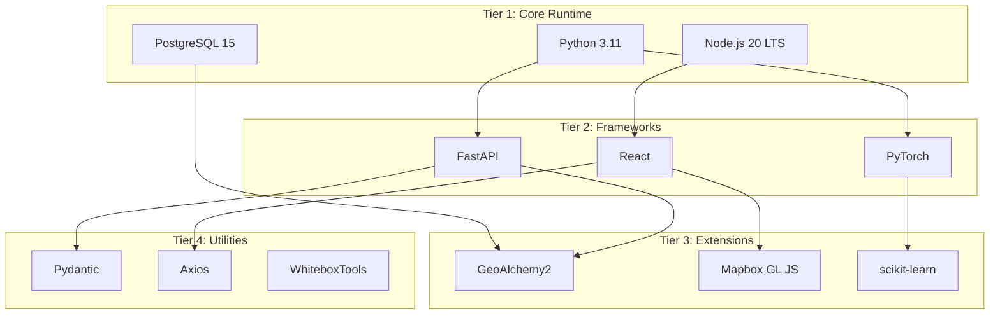

# Diagram 18: Technology Stack Overview

A comprehensive diagram showing all technologies used in each layer of the system with version numbers and relationships.

---

## Complete Technology Stack

```mermaid
flowchart TD
    subgraph FrontendStack["🖥️ Frontend Layer"]
        subgraph WebDashboard["Web Dashboard"]
            FE1["React 18.2<br/>(UI Framework)"]
            FE2["React Router 6<br/>(Navigation)"]
            FE3["Mapbox GL JS 3.0<br/>(Interactive Maps)"]
            FE4["Chart.js 4.0<br/>(Visualizations)"]
            FE5["Axios 1.6<br/>(HTTP Client)"]
            FE6["TailwindCSS 3.4<br/>(Styling)"]
        end
        
        subgraph MobileApp["Mobile PWA"]
            MA1["React Native 0.73<br/>(Cross-platform)"]
            MA2["Expo SDK 50<br/>(Build Tools)"]
            MA3["React Navigation 6<br/>(Routing)"]
            MA4["AsyncStorage<br/>(Local Data)"]
            MA5["Expo Location<br/>(GPS)"]
            MA6["Expo Camera<br/>(Photo Capture)"]
        end
    end

    subgraph BackendStack["⚡ Backend Layer"]
        subgraph APIServer["API Server"]
            BE1["Python 3.11<br/>(Runtime)"]
            BE2["FastAPI 0.109<br/>(Web Framework)"]
            BE3["Uvicorn 0.27<br/>(ASGI Server)"]
            BE4["Pydantic 2.5<br/>(Validation)"]
            BE5["SQLAlchemy 2.0<br/>(ORM)"]
            BE6["GeoAlchemy2 0.14<br/>(Spatial ORM)"]
        end
        
        subgraph AsyncProcessing["Async Processing"]
            AP1["Celery 5.3<br/>(Task Queue)"]
            AP2["Redis 7.2<br/>(Broker)"]
            AP3["Kafka 3.6<br/>(Event Streaming)"]
            AP4["kafka-python 2.0<br/>(Consumer)"]
        end
    end

    subgraph MLStack["🧠 ML/AI Layer"]
        subgraph CoreML["Core ML Libraries"]
            ML1["scikit-learn 1.4<br/>(RF, DBSCAN)"]
            ML2["PyTorch 2.1<br/>(CNN)"]
            ML3["torchvision 0.16<br/>(ResNet-50)"]
            ML4["LightGBM 4.2<br/>(Gradient Boosting)"]
            ML5["XGBoost 2.0<br/>(Ensemble)"]
        end
        
        subgraph MLSupport["ML Support"]
            MS1["NumPy 1.26<br/>(Numerical)"]
            MS2["Pandas 2.1<br/>(DataFrames)"]
            MS3["SciPy 1.12<br/>(Statistics)"]
            MS4["Pillow 10.2<br/>(Image Processing)"]
            MS5["OpenCV 4.9<br/>(Computer Vision)"]
        end
    end

    subgraph GeospatialStack["🗺️ Geospatial Layer"]
        GE1["PostGIS 3.4<br/>(Spatial DB Extension)"]
        GE2["GDAL 3.8<br/>(Raster I/O)"]
        GE3["Rasterio 1.3<br/>(Python Raster)"]
        GE4["Shapely 2.0<br/>(Geometry)"]
        GE5["PyProj 3.6<br/>(Projections)"]
        GE6["WhiteboxTools 2.3<br/>(Hydro Analysis)"]
    end

    subgraph DatabaseStack["💾 Database Layer"]
        DB1["PostgreSQL 15<br/>(Primary RDBMS)"]
        DB2["PostGIS 3.4<br/>(Spatial Extension)"]
        DB3["Redis 7.2<br/>(Cache/Session)"]
        DB4["MongoDB 7.0<br/>(Analytics Logs)"]
    end

    subgraph CloudStorage["☁️ Cloud Storage"]
        CS1["AWS S3<br/>(Image Storage)"]
        CS2["CloudFront<br/>(CDN)"]
    end

    subgraph ExternalAPIs["🌐 External APIs"]
        EA1["Google Maps Platform<br/>(Geocoding)"]
        EA2["Twitter API v2<br/>(Social Ingestion)"]
        EA3["NewsAPI.org<br/>(News Corroboration)"]
        EA4["IMD API<br/>(Weather Data)"]
        EA5["ISRO Bhuvan<br/>(Satellite)"]
        EA6["Twilio<br/>(SMS)"]
        EA7["Firebase FCM<br/>(Push Notifications)"]
    end

    subgraph DevOps["🐳 DevOps Layer"]
        DO1["Docker 24.0<br/>(Containerization)"]
        DO2["Docker Compose 2.24<br/>(Orchestration)"]
        DO3["Nginx 1.25<br/>(Reverse Proxy)"]
        DO4["GitHub Actions<br/>(CI/CD)"]
        DO5["pytest 8.0<br/>(Testing)"]
        DO6["Black + Ruff<br/>(Linting)"]
    end

    %% Connections
    FE1 --> FE5
    FE5 --> BE2
    MA1 --> BE2
    
    BE2 --> BE5
    BE5 --> GE6
    BE5 --> DB1
    GE6 --> DB2
    
    BE2 --> AP1
    AP1 --> AP2
    AP1 --> ML1
    
    ML1 --> MS1
    ML2 --> MS4
    
    GE1 --> DB1
    GE3 --> GE2
    
    BE2 --> EA1
    BE2 --> EA6
    BE2 --> EA7

    %% Styling
    classDef feNode fill:#e3f2fd,stroke:#1565c0,stroke-width:2px
    classDef beNode fill:#e8f5e9,stroke:#2e7d32,stroke-width:2px
    classDef mlNode fill:#f3e5f5,stroke:#7b1fa2,stroke-width:2px
    classDef geoNode fill:#fff3e0,stroke:#ef6c00,stroke-width:2px
    classDef dbNode fill:#fce4ec,stroke:#c2185b,stroke-width:2px
    classDef cloudNode fill:#e0f7fa,stroke:#00838f,stroke-width:2px
    classDef extNode fill:#fff8e1,stroke:#f9a825,stroke-width:2px
    classDef devNode fill:#c8e6c9,stroke:#388e3c,stroke-width:2px

    class FE1,FE2,FE3,FE4,FE5,FE6,MA1,MA2,MA3,MA4,MA5,MA6 feNode
    class BE1,BE2,BE3,BE4,BE5,BE6,AP1,AP2,AP3,AP4 beNode
    class ML1,ML2,ML3,ML4,ML5,MS1,MS2,MS3,MS4,MS5 mlNode
    class GE1,GE2,GE3,GE4,GE5,GE6 geoNode
    class DB1,DB2,DB3,DB4 dbNode
    class CS1,CS2 cloudNode
    class EA1,EA2,EA3,EA4,EA5,EA6,EA7 extNode
    class DO1,DO2,DO3,DO4,DO5,DO6 devNode
```

---

## Dependency Hierarchy

---

## Version Matrix

| Component | Development | Production | Notes |
|-----------|-------------|------------|-------|
| Python | 3.11.7 | 3.11.7 | Match exactly |
| Node.js | 20.10.0 | 20.10.0 | LTS version |
| PostgreSQL | 15.5 | 15.5 | With PostGIS 3.4 |
| FastAPI | 0.109.0 | 0.109.0 | Latest stable |
| PyTorch | 2.1.2 | 2.1.2 | CPU for server |
| scikit-learn | 1.4.0 | 1.4.0 | Latest |
| React | 18.2.0 | 18.2.0 | Stable |
